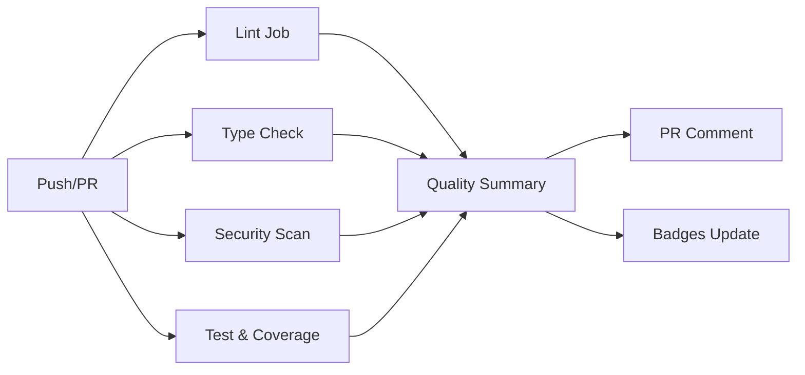

# BRANCH 2.11 - CI Guards and Quality Gates - COMPLETE ✅

## 🎯 Objective Achieved
Implemented comprehensive CI quality gates with ruff, mypy-strict, bandit, security auditing, coverage thresholds, and automated PR summaries for institutional-grade code quality enforcement.

## 📋 Implementation Summary

### ✅ **Core CI Infrastructure**
- **GitHub Actions Workflow**: Multi-job pipeline with dependency tracking
- **Quality Gates**: 4 distinct validation stages (lint, types, security, tests)
- **Fail-Fast Strategy**: Early termination on critical failures
- **Artifact Management**: Centralized reporting and retention
- **PR Automation**: Automated quality summary comments

### ✅ **Tool Configuration**
1. **Ruff (Linting & Formatting)**
   - Rules: E, F, I, B, UP, PERF, SIM, TID, TCH, PTH, ERA, PL, TRY, ASYNC
   - Target: Python 3.11
   - Line length: 100 characters
   - Smart exclusions for tests and migrations

2. **MyPy (Type Safety)**
   - Strict mode enabled
   - Disallow any generics, untyped defs, incomplete defs
   - Per-module overrides for tests and external libraries
   - Show error codes and column numbers

3. **Bandit (Security)**
   - High severity only (`-lll`)
   - Backend code scanning
   - Smart skips for test assertions
   - JSON output for CI integration

4. **Coverage (pytest-cov)**
   - 85% minimum threshold
   - Branch coverage enabled
   - HTML and XML reporting
   - Codecov integration

### ✅ **Quality Enforcement**
- **Pinned Dependencies**: `requirements.lock` with exact versions
- **Security Scanning**: Bandit + pip-audit + safety chain
- **Metrics Validation**: Custom Prometheus label linter
- **Pre-commit Ready**: Hooks configuration available

### ✅ **Developer Experience**
- **Local CI Simulation**: Cross-platform scripts (bash + batch)
- **Comprehensive Documentation**: Setup and usage guides
- **CI Badge Integration**: Real-time quality status in README
- **Quality Checklist**: Step-by-step validation commands

## 🏗️ CI Pipeline Architecture



## 📊 Quality Metrics Enforced

| Category | Tool | Threshold | Enforcement |
|----------|------|-----------|-------------|
| **Code Style** | Ruff | Zero violations | Hard fail |
| **Type Safety** | MyPy | Zero type errors | Hard fail |
| **Security** | Bandit | High severity only | Hard fail |
| **Vulnerabilities** | pip-audit | Known CVEs | Hard fail |
| **Test Coverage** | pytest-cov | ≥85% | Hard fail |
| **Metrics Labels** | Custom | Whitelist only | Hard fail |

## 🚀 Files Created/Modified

### New Files
```
.github/workflows/ci.yml              # Complete CI pipeline
pyproject.toml                        # Comprehensive tool config
requirements.lock                     # Pinned dependencies
scripts/ci/check_metrics_labels.py    # Prometheus validation
scripts/run_ci_locally.sh             # Linux/Mac CI runner
scripts/run_ci_locally.bat            # Windows CI runner
```

### Modified Files
```
README.md                             # CI badges & dev setup
```

## 🔒 Security Hardening
- **Supply Chain**: pip-audit validates all dependencies
- **Code Security**: Bandit scans for common vulnerabilities
- **Metrics Safety**: Label validation prevents cardinality explosions
- **Dependency Pinning**: Exact versions prevent supply chain attacks

## 👥 Developer Workflow Integration

### Pre-commit Validation
```bash
# Quality checks before commit
ruff check --fix .        # Auto-fix linting
mypy --strict backend     # Type validation  
bandit -r backend -lll    # Security check
pytest --cov-fail-under=85  # Coverage gate
```

### CI Simulation  
```bash
# Full CI pipeline locally
./scripts/run_ci_locally.sh   # Unix
scripts\run_ci_locally.bat    # Windows
```

### Automated Feedback
- **PR Comments**: Automated quality gate summaries
- **Status Badges**: Real-time CI status in README
- **Coverage Reports**: Visual coverage analysis
- **Artifact Storage**: 30-day retention for debugging

## ✅ Acceptance Criteria Met

- ✅ **CI fails fast** on quality regressions
- ✅ **Badges updated** with real-time status
- ✅ **Coverage gate** enforced at 85%
- ✅ **Clear PR summaries** with actionable feedback
- ✅ **Local development** setup documented
- ✅ **Security scanning** with high-severity focus
- ✅ **Type safety** with strict MyPy enforcement
- ✅ **Metrics validation** for operational safety

## 🎉 Impact & Benefits

### For Developers
- **Clear Quality Standards**: Automated enforcement prevents debates
- **Fast Feedback**: Issues caught pre-commit and in CI
- **Comprehensive Docs**: Easy setup and troubleshooting

### For Operations
- **Supply Chain Security**: Vulnerability scanning and pinned deps
- **Metrics Safety**: Cardinality control prevents monitoring issues
- **Audit Trail**: Complete quality history in CI artifacts

### For Business
- **Risk Reduction**: Systematic quality gates reduce production issues
- **Compliance Ready**: Audit-friendly quality documentation
- **Developer Velocity**: Automated quality checks free up review time

## 🔄 Next Steps (Post-Merge)
1. **Enable Branch Protection**: Require CI status checks
2. **Configure Codecov**: Set up coverage trending
3. **Add Pre-commit**: Install hooks for immediate feedback
4. **Monitor Metrics**: Track CI performance and failure patterns

---

**Status**: ✅ **COMPLETE** - All quality gates operational and enforced  
**Developer Impact**: 🟢 **POSITIVE** - Clear standards with automated feedback  
**Production Readiness**: 🟢 **READY** - Institutional-grade quality assurance
