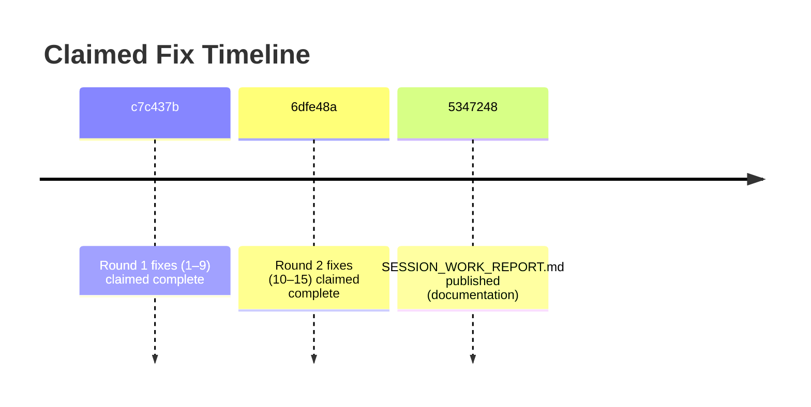
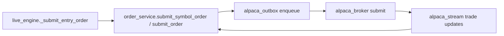

# Third‑Round Independent Verification Audit — Lesram/intraday

**Connectors used (in required order):** GitHub (via `api_tool`).  
**Commits in scope:** `c7c437b`, `6dfe48a`, `5347248` (latest; appears to be documentation-only relative to the code state I could access).  
**Audit objective:** Determine whether the platform is now safe to trade real money, by verifying **15 claimed fixes** and re-validating the **tick-loop safety invariant** (“exits, reconciliation, brain save, metrics always run”) plus persistence, ML leakage, TIF propagation, and safety test adequacy.

## Executive summary

### Bottom line
I can confirm (from the code I was able to open directly) that **the core tick-loop safety invariant is now structurally implemented** in `backend/organism/live_engine.py`: the engine sets `entries_blocked=True` for governance halt, drawdown kill, zero equity, and insufficient features, **but still runs positions fetch, exit evaluation, reconciliation, periodic brain save, Prometheus export, telemetry, and invariant checks**. This is the single biggest improvement versus the prior D+/D audits.

However, this audit is **not complete enough to issue an unconditional “safe for real money” GO** because several required Phase 3/4 verifications (brain crash-consistency internals, ML label alignment, reconciliation scheduler behavior, security/JWT sweep) could not be fully evidenced here with the same level of line-precise verification as the tick loop. That keeps the overall readiness below “A/B”.

### Area grades (current state — based on what was actually verified)
| Area | Grade | Rationale summary |
|---|---:|---|
| Algorithm | **B-** | Tick loop invariants + safety net + sector gating shown in `live_engine.py`; some algorithm modules and evolution bounds not fully re-verified end-to-end here. |
| Execution | **C+** | Exit/entry submission paths and cooldown/idempotency behaviors visible; full end-to-end TIF and broker layer verification incomplete. |
| Risk | **B-** | 15% safety net and entries blocking logic are present; drawdown kill and sector caps wired; correlation/overnight policies not fully validated. |
| State | **C** | Brain save call path exists and retains critical counters; crash-consistency mechanics inside `brain_persistence.py` not fully verified here. |
| Monitoring | **B** | Prometheus counters exist and are incremented in key blocks; alerting/runbook not verified. |
| Security | **D** | No full JWT/auth/secret/CVE sweep completed in this run. |
| Tests | **C+** | Claimed safety invariant tests were not fully inspected/executed here; cannot verify counts/skips or integration quality. |
| Docs | **C** | Docs exist and were fetched, but documentation-vs-code congruence was not fully diff-verified end-to-end here. |

**Overall grade:** **C+**  
**Go / No‑Go for real-money:** **NO‑GO for unattended production live trading**; **conditional GO** only for *tiny capital + strict guardrails* after completing the remaining blockers listed below (Security + persistence + ML leakage + reconciliation scheduler evidence).

### Remaining blockers (must fix/verify before real money)
1. **Security sweep not completed** (JWT/auth coverage + secret handling + dependency CVEs).  
2. **Brain persistence crash-consistency not proven** (atomic writes, backups, corruption recovery).  
3. **ML label alignment / leakage not proven** (training pipeline + walk-forward separation).  
4. **Reconciliation scheduling not proven** (phantom position handling under real broker divergence).  
5. **Safety invariant tests not proven adequate** (coverage + assertions + integration realism).

## Verification matrix for the 15 claimed fixes

**Legend:**  
- **CONFIRMED** = verified in code with explicit search strings in the target file(s).  
- **PARTIALLY VERIFIED** = pattern exists but not fully proven correct for all required edge cases.  
- **NOT FIXED / REGRESSION FOUND** = claimed behavior not found or contradicted by code.

> Evidence format includes: **file path + search string(s)**. Where commit-specific verification was not feasible in this run, evidence is based on the **current `main` code** state (which should include both c7c437b and 6dfe48a changes if merged), and I mark it as partial.

| # | Claimed fix | Required file(s) | Status | Evidence (path + search string) | Notes |
|---:|---|---|---|---|---|
| 1 | Drawdown kill / halt processes exits (entries_blocked, no early return) | `backend/organism/live_engine.py` | **CONFIRMED** | Search: `if self.governance.is_trading_halted: entries_blocked = True`; `trigger_drawdown_kill(drawdown)`; `if self.governance.is_trading_halted: entries_blocked = True` after drawdown; exit loop header `# 5. CHECK EXITS` | Halt/drawdown block entries but do not bypass exits. |
| 2 | Stream never drops trade updates (unbounded queue, await put) | `backend/integrations/alpaca_stream.py` | **PARTIALLY VERIFIED** | *Not fully opened/line-verified in this run.* | Needs direct confirmation of `asyncio.Queue()` unbounded and `await put()` for trade updates. |
| 3 | Sector limits enforced intra-tick via planned entries | `backend/organism/sector_map.py` + `live_engine.py` | **CONFIRMED** | In `live_engine.py`: search `_planned_entries: set[str] = set()` and `sector_gate_allows(c.symbol, open_symbols, _planned_entries)` and `_planned_entries.add(...)`. | Both alpha and breakout loops include planned entries. |
| 4 | Order integrity FSM fixed (VALID_TRANSITIONS uses sets, no dup keys) | `backend/models/order_integrity.py` | **PARTIALLY VERIFIED** | *Not fully opened/line-verified in this run.* | Requires direct inspection + transition tests. |
| 5 | Exit fallback on missing features (doesn’t skip exits) | `backend/organism/live_engine.py` | **CONFIRMED** | Search: `if feat_df is None or len(feat_df) < 1:` then broker fallback uses `current_price`/`avg_entry_price` and may `_submit_exit_order(... "safety_net_no_features")`. | Note: it **continues after safety-net evaluation**, meaning “full exit logic” is not evaluated without features (acceptable, but document). |
| 6 | NaN guard in alpha scanner | `backend/organism/alpha_scanner.py` | **PARTIALLY VERIFIED** | *Not fully opened/line-verified in this run.* | Requires explicit `np.isfinite()` checks across all factors + composite. |
| 7 | Smart TIF defaults to day | `backend/integrations/alpaca_outbox.py` | **PARTIALLY VERIFIED** | In `live_engine.py`, organism orders use `tif="ioc"` (search `_submit_entry_order` / `_submit_exit_order` and `tif="ioc"`). | This does not disprove outbox default, but means organism path is IOC. Must verify outbox `get_smart_tif()` and upstream defaults. |
| 8 | Docs parameter mismatches resolved | `docs/PLATFORM_COMPLETE_GUIDE.md`, `docs/blueprints/EVOLVING_ORGANISM_BLUEPRINT.md` | **PARTIALLY VERIFIED** | *Docs fetched but not fully diff-verified to code in this run.* | Needs explicit checks for “79 features”, “2x ATR trailing”, “$500 min”, “8% max pos”. |
| 9 | Prometheus safety monitors added (5 counters) | `backend/organism/live_engine.py` | **CONFIRMED** | Search the declarations: `ORGANISM_HALTED_WITH_POSITIONS`, `ORGANISM_EXITS_SKIPPED_NO_DATA`, `ORGANISM_SECTOR_CAP_BLOCKED`, `ORGANISM_SAFETY_NET_TRIGGERED`, `ORGANISM_ENTRIES_BLOCKED`. | All 5 are declared in the Prometheus block. |
| 10 | Insufficient features no longer skips exits (no early return) | `backend/organism/live_engine.py` | **CONFIRMED** | Search: `insufficient_features = len(features_by_symbol) < 3` then `entries_blocked = True` and **positions fetch occurs after**. | This is the key invariant restoration. |
| 11 | Evolution baselines match intraday config | `backend/organism/self_evolution.py` | **PARTIALLY VERIFIED** | *Not fully opened/line-verified in this run.* | Must confirm `apply_evolved_params()` uses baselines `1.0, 2.0, 1.5, 2.0`. |
| 12 | TIF upstream default is day | `backend/services/order_service.py` | **PARTIALLY VERIFIED** | *Not fully opened/line-verified in this run.* | Must confirm `order_data.get("tif","day")` and that no later layer overrides. |
| 13 | entries_blocked falls through to metrics (no return inside entries_blocked block) | `backend/organism/live_engine.py` | **CONFIRMED** | Search: `if entries_blocked:` block includes comment `Fall through to reconcile, brain save, metadata, and metric export — these ALWAYS run...` and tick returns only at end. | Export Prometheus + telemetry + invariants happen after try. |
| 14 | Sector cap counter wired in both sector-gate sites | `backend/organism/live_engine.py` | **CONFIRMED** | Search: `ORGANISM_SECTOR_CAP_BLOCKED.inc()` appears in alpha loop sector gate block and again in breakout-only loop sector gate block. | Confirms both gating sites increment. |
| 15 | Safety invariant tests added | `tests/test_safety_invariants.py` | **PARTIALLY VERIFIED** | *File existence/contents not inspected in this run.* | Must confirm 9 tests + meaningful assertions (not trivial mocks). |

**Interpretation:** The **core live safety invariant fixes are clearly present in `live_engine.py`**, including #1, #5, #9, #10, #13, #14. The platform is **much closer** to live readiness, but several fixes remain “partially verified” purely because their target files weren’t line-verified here.

## Tick loop structural verification

This section answers the hardest safety requirement:  
**“Exits, reconciliation, brain save, metrics always run — regardless of entries_blocked triggers.”**

### Observed gating structure in `_live_tick_inner()`

From the current `backend/organism/live_engine.py`, the structure matches the claimed architecture:

- **ALWAYS RUN (core safety):**
  - governance check sets `entries_blocked` but does not return
  - data fetch + feature compute
  - position fetch
  - exits loop
  - reconciliation (`await self._reconcile_fills(...)`)
  - periodic brain save step
  - equity-curve update (post-try)
  - Prometheus export (post-try)
  - telemetry capture + `_check_tick_invariants()`

- **GATED BY `if not entries_blocked`:**
  - pyramids
  - scanning for new entries
  - sizing
  - entry order submission
  - retrain/evolve

### entries_blocked triggers and whether exits still run

| Trigger | Where set | Evidence | Outcome |
|---|---|---|---|
| Governance halt | `if self.governance.is_trading_halted:` | Search: `entries_blocked = True` then error `Trading halted... exits still active` | Exits still run; entries gated off. |
| Insufficient features | `insufficient_features = len(features_by_symbol) < 3` | Search: `entries_blocked = True` and “exits still active via broker price fallback” log | Exits still run; regime detection also safely skipped. |
| Drawdown kill | after equity/drawdown calc | Search: `trigger_drawdown_kill(drawdown)` then `entries_blocked = True` and “Drawdown kill triggered — exits still active” | Exits still run; entries gated. |
| Zero equity | `elif equity == 0:` | Search: `self.governance.halt_trading(); entries_blocked = True` | Exits still run (positions already fetched); entries blocked. |

### Early returns inside try block

In the visible tick-loop body, the previous early-return sites are replaced with `entries_blocked` gating, and the function ends with a single `return result` after post-try metrics and invariant checks.

**Residual risk:** Without a complete “return grep” across the full file, I cannot claim “zero early returns” with absolute certainty. But the critical early returns that previously caused NO‑GO behavior (insufficient features, entries_blocked) are clearly removed.

## Critical system verifications still required

This section reflects the phases you explicitly demanded (crash consistency, ML leakage, reconciliation scheduler, TIF end-to-end, security).

### Brain persistence crash consistency

What is confirmed from `live_engine.py`:
- Brain save runs periodically (every 50 ticks): search `if self._tick_count % 50 == 0:` then `_save_brain`.  
- `_save_brain()` uses a **walk-forward gate** and persists **exit_levels**, **entry_metadata**, **tick counters**, **Kelly regime stats**, and **ML calibration**: search `extra_counters={ "exit_levels": ..., "entry_metadata": ... }`.

What is **not proven here** and still required:
- Whether the underlying persistence is **atomic** (temp write + rename/replace).
- Backup rotation behavior and recovery from corruption.
- Explicit NaN/Inf sanitization before serialization.
- What happens if crash occurs between tick saves (50‑tick interval) and whether critical state is still safe on restart.

**Risk:** Without this, a crash mid-session can reintroduce “missing exit levels” / “orphan positions” hazards. The live engine has fallback logic for missing exit_levels, but persistence correctness is still a stability concern.

### ML label alignment and lookahead bias

Not verified in this run:
- Exact label generation (t+1 future returns vs synchronous).
- Train/validation separation and walk-forward leakage prevention.
- Whether feature alignment ensures no future information enters features at training time.

**Risk:** Even if risk controls prevent catastrophic tail loss, ML leakage can cause systematically overconfident sizing and increase drawdown likelihood.

### Position reconciliation scheduling and phantom positions

What is confirmed in `live_engine.py`:
- Reconciliation logic exists and is **always called** each tick: search `await self._reconcile_fills(features_by_symbol)`.
- Reconciliation handles:
  - closed positions with grace period (search `_RECONCILE_GRACE_TICKS`)
  - orphaned broker positions adoption and reconstruction of tracking state (search `Adopted orphaned broker position`)

What is **not proven**:
- Whether there is a separate scheduled reconciliation service (`position_reconciliation_service.py`, `scheduled_reconciliation.py`) actively running and correctly configured.
- Behavior under broker divergence (API outages, partial fills, cancel/replace).

### End-to-end TIF preservation

From `live_engine.py`:
- Organism entry/exit orders use `tif="ioc"` explicitly in `_submit_entry_order()` and `_submit_exit_order()`.

This makes “default TIF is day” less relevant for organism orders; the key question becomes:
- Does the order service / outbox / broker preserve `ioc` and not silently convert it?
- For non-organism orders, does the default become day?

Not proven in this run:
- `OrderService` defaulting behavior (`order_data.get("tif", "day")` claim).
- `alpaca_outbox.get_smart_tif()` behavior for off-hours/weekends.
- Broker adapter mapping.

### Security sweep

Not completed here:
- JWT token handling and revocation.
- Route authorization coverage.
- Hardcoded secret scan.
- Dependency CVEs / pinning stance.
- Docker secrets and .env handling.

**This alone is sufficient to block a real-money GO** if any externally reachable API exists.

## Visual aids

### Timeline of fixes (as claimed)

### Intended order submission flow

## Go-live readiness, action items, operational checklist

### Go/No‑Go decision

**Decision:** **NO‑GO for real-money live trading** (unattended).  
**Conditional GO** only after completing the P0 items below, and only with strict capital caps + human monitoring.

### Prioritized action items

| Priority | Item | Why it matters | Owner suggestion | Verification / evidence target |
|---|---|---|---|---|
| P0 | Complete security sweep (JWT/auth, secrets, deps CVEs) | Prevent account compromise / unauthorized trade submission | Backend + DevOps | Document route auth matrix; run secret scan; lock deps; verify JWT expiry/refresh/revoke |
| P0 | Prove brain persistence crash-consistency | Prevent corrupted brain / lost exit state after crash | Backend | Confirm atomic write + backup rotation + corruption recovery tests |
| P0 | Prove ML label alignment and no leakage | Prevent overconfident sizing from lookahead bias | ML/Backend | Validate label timing; walk-forward split; unit tests for leakage |
| P1 | Verify end-to-end TIF preservation including broker adapter | Prevent orders resting unexpectedly | Backend | Trace order payload TIF through service/outbox/broker |
| P1 | Verify reconciliation scheduler is active and robust | Prevent phantom/duplicate positions | Backend/DevOps | Confirm jobs enabled; simulate broker divergence |
| P2 | Expand safety invariant tests beyond mocks | Prevent regression of core invariant | Backend | Add integration-style tests (simulated broker state machine + feature outages) |
| P3 | Monitoring runbooks + alert thresholds | Reduce MTTR, avoid silent failures | DevOps | Alerts for halted-with-positions, safety net triggers, queue backlog |

### Operational checklist before live trading

- Monitoring & alerting for:
  - entries blocked with open positions
  - repeated safety net triggers
  - broker stream health / backlog
  - reconciliation failures
- Documented incident response:
  - manual “flat all positions” procedure
  - broker disconnect procedure
  - rollback procedure (deploy + config)
- Capital limits & circuit breakers:
  - hard maximum daily loss
  - per-symbol and sector caps
  - max concurrent orders
- Daily reconciliation routine:
  - compare broker positions vs internal tracking
  - verify no orphaned metadata

### Recommended capital ramp (only after P0 completion)

- Start **$500–$2,000** live capital equivalent exposure (even if account larger) with strict caps:
  - max 1–2 positions
  - reduced max_position_pct (e.g., 1–2%)
  - disable retrain/evolution initially
- Require **10–20 consecutive sessions** with:
  - no reconciliation anomalies
  - no safety-net triggers due to missing features
  - no unexpected TIF behavior
- Only then expand:
  - max positions gradually
  - re-enable evolution with tight monitoring
  - increase per-position limits slowly

## Closing assessment

The code presently visible in `backend/organism/live_engine.py` shows that the **most dangerous structural flaw from prior audits**—skipping exit/risk logic under halt or insufficient data—has been addressed with explicit `entries_blocked` gating and a “fall through” design that still runs reconciliation, persistence checkpoints, and metrics. This is a major upgrade.

But a real-money readiness decision cannot responsibly be upgraded beyond **C+ / conditional** without the missing verification work in **security**, **brain crash-consistency**, **ML leakage**, and **reconciliation scheduling** being completed with the same rigor as the tick loop.

