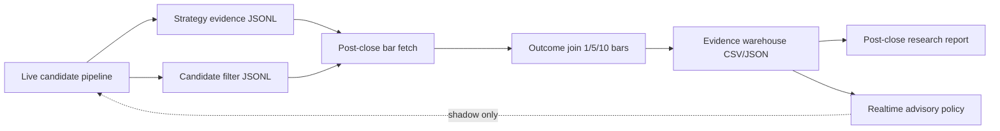

# Phase 6 Strategy Evidence Warehouse Plan

Generated: 2026-05-06 UTC
Branch: `codex/v13-phase2-expectancy`

## Scope

Phase 6 turns the paper platform into a strategy research loop:

1. Capture live candidate evidence.
2. Join that evidence to post-close forward returns.
3. Produce an advisory policy.
4. Keep live behavior unchanged until an idea passes sample, replay, and review.

This phase is deliberately observability-first. It may recommend shadow actions
such as `reject_or_redesign`, `collect_more_shadow_sample`, or
`eligible_for_replay_review`, but it must not alter ranking, sizing, gates, or
order submission.

## Architecture



## Implemented Slice

- `ORGANISM_STRATEGY_EVIDENCE_TELEMETRY_ENABLED`
  - Default: `false`.
  - When enabled, records every surviving pre-sizing candidate.
  - No live behavior change.
- `ORGANISM_STRATEGY_EVIDENCE_TELEMETRY_PATH`
  - Default: `organism_brain/strategy_evidence_events.jsonl`.
- `scripts/phase6_strategy_evidence_warehouse.py`
  - Normalizes candidate events.
  - Adds warehouse buckets: `all_candidates`, existing filter tags, or `untagged`.
  - Joins outcomes using cached bars.
  - Writes normalized events, outcomes, summary, advisory policy, and markdown.

## Output Artifacts

Default output directory: `artifacts/phase6_strategy_evidence/`

- `strategy_evidence_events.csv`
- `strategy_evidence_outcomes.csv`
- `strategy_evidence_summary.json`
- `realtime_advisory_policy.json`
- `POSTCLOSE_RESEARCH_REPORT.md`
- `outcome_join/summary_shadow_outcome_join.json`

## Advisory Policy Rules

Primary horizon: `5` bars.

- If sample/outcome gates fail: `collect_more_shadow_sample`.
- If sample/outcome gates pass but mean directional return or win rate is below
  threshold: `reject_or_redesign`.
- If gates pass and thresholds pass: `eligible_for_replay_review`.

The default thresholds are intentionally modest:

- minimum filter events: `30`
- minimum joined outcomes: `20`
- minimum mean directional return: `1.0` bp
- minimum win rate: `0.50`

Eligibility only permits replay review. It does not authorize live promotion.

## Daily Execution

After market close:

```bash
./venv/bin/python scripts/phase5_fetch_shadow_bars.py \
  --telemetry-path organism_brain/strategy_evidence_events.jsonl \
  --out-dir artifacts/phase5_shadow_live_bars \
  --lookback 1000

./venv/bin/python scripts/phase6_strategy_evidence_warehouse.py \
  --telemetry-path organism_brain/strategy_evidence_events.jsonl \
  --cache-dir artifacts/phase5_shadow_live_bars \
  --bar-file bars.pkl
```

Until the new strategy evidence file has enough rows, the warehouse script can
run against the Phase 5 candidate-filter telemetry:

```bash
./venv/bin/python scripts/phase6_strategy_evidence_warehouse.py \
  --telemetry-path organism_brain/candidate_filter_shadow_telemetry.jsonl \
  --cache-dir artifacts/phase5_shadow_live_bars \
  --bar-file bars.pkl
```

## Promotion Path

1. Shadow evidence passes sample and outcome gates.
2. Replay confirms the effect after transaction costs and realistic slippage.
3. A guarded promotion PR adds tests and runtime snapshot diffs.
4. Paper live behavior is enabled behind a kill switch.
5. Only after stable paper evidence should real-capital behavior be considered.

## Current Position

Phase 6 is ready to collect richer evidence in paper. The next paper session
should run with both Phase 5 filter telemetry and Phase 6 strategy evidence
telemetry enabled. The platform should continue trading only under the existing
logic while the advisory policy remains shadow-only.
