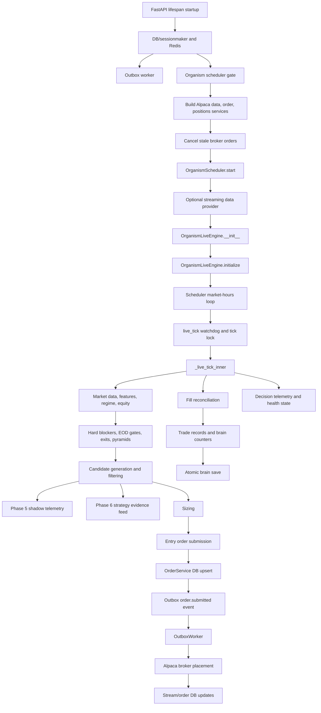

# Phase 7 Architecture Baseline

Generated: 2026-05-06 UTC
Branch: `codex/v13-phase2-expectancy`
Baseline HEAD while inspected: `b18478b26e14a046e14cf12bc82ded49ab0db4ca`

## Verdict

The paper runtime is mechanically understandable, but the live organism engine
still concentrates too much behavior in one class and one tick method. The
system now has good runtime-truth gates around deploy parity, health, migration
head, audit-chain integrity, runtime snapshots, and strategy health, but future
strategy work will remain risky until decision, telemetry, sizing, execution,
and persistence boundaries are separated.

The first Phase 7 code slice should be behavior-preserved extraction of
candidate evidence telemetry fanout from `_live_tick_inner`. It is small, recent,
testable, and designed to be observational only. It is the cleanest place to
prove the extraction discipline before touching safety gates, sizing, or order
intent.

One extra hygiene issue surfaced during this architecture pass: tracked April
archive snapshots contained live-looking Alpaca credential values, and Phase 7
runtime artifacts could preserve raw `docker-compose config` output locally.
This pass redacted the tracked archive copies and added checkpoint-output
redaction. Because git history may still contain the old values, the operational
recommendation is to rotate the exposed paper Alpaca key outside the repository.

## Evidence Inputs

- Runtime integration checkpoint: `artifacts/phase7/integration_validation.json`
  reported 14 PASS checks, including container/head parity, hot-path byte
  parity, `/healthz`, authenticated `/api/v1/health/strategy`, migration head,
  audit-chain integrity, deploy-parity sandbox, compose config, runtime
  snapshot, and migration smoke.
- Baseline snapshot: `artifacts/phase7/baseline_snapshot.json` reported
  container `GIT_SHA=b18478b26e14a046e14cf12bc82ded49ab0db4ca`, exploration
  disabled, Phase 5 and Phase 6 telemetry env flags enabled, zero open
  positions, migration head `20260503_000003`, 520 brain trade-history rows,
  and 0 strategy-evidence telemetry rows at the time of capture.
- God-method inventory: `artifacts/phase7/god_method_inventory.json` reported
  283 backend Python files, 50 backend functions over 150 LOC, 20 files over
  threshold, and `_live_tick_inner` at 2802 LOC.
- Code reads:
  - `backend/api/lifespan.py:232` starts the outbox worker.
  - `backend/api/lifespan.py:357` starts the organism scheduler when enabled.
  - `backend/api/lifespan.py:549` builds scheduler dependencies.
  - `backend/organism/scheduler.py:72` owns the background engine loop.
  - `backend/organism/scheduler.py:182` constructs `OrganismLiveEngine`.
  - `backend/organism/live_engine.py:1764` wraps live ticks in the watchdog.
  - `backend/organism/live_engine.py:1954` begins `_live_tick_inner`.
  - `backend/organism/live_engine.py:4190` records Phase 5 candidate shadow
    telemetry.
  - `backend/organism/live_engine.py:4211` records Phase 6 strategy evidence
    telemetry.
  - `backend/organism/live_engine.py:4249` calls the sizer.
  - `backend/organism/live_engine.py:4390` submits entry orders.
  - `backend/organism/live_engine.py:4517` reconciles fills.
  - `backend/organism/live_engine.py:4678` performs periodic brain save.
  - `backend/organism/live_engine.py:4728` persists decision telemetry.
  - `backend/organism/brain_persistence.py:387` begins full atomic brain save.
  - `backend/services/order_service.py:1508` begins async order submission.
  - `backend/infra/outbox_worker.py:375` processes outbox events.
  - `backend/integrations/alpaca_outbox.py:218` places the broker order.

## Runtime Flow



## Ownership Boundaries

| Area | Current owner | What it owns now | Boundary concern |
|------|---------------|------------------|------------------|
| Startup and composition | `backend/api/lifespan.py` | DB init, Redis token blacklist, background workers, policy engines, scheduler startup, stream startup | Too many production toggles are composed in one startup path; runtime checks are good, but responsibility is broad. |
| Tick scheduling | `backend/organism/scheduler.py` | Market-hours loop, timeout wrapper, streaming provider lifecycle, WebSocket broadcast | Reasonable owner. Keep this as orchestration only. |
| Live trading decision | `backend/organism/live_engine.py` | Scanners, safety gates, exits, pyramids, sizing, order submission, reconciliation, evolution, brain saves, telemetry | Main risk. One file owns nearly every capital-impacting stage. |
| Candidate evidence | `backend/organism/candidate_shadow_telemetry.py` | Candidate tag inference and JSONL appends | Good utility boundary, but live engine owns the fanout and counters inline. |
| Sizing | `backend/organism/kelly_sizer.py` | Position sizing and rejection reasons | Boundary exists, but live engine still prepares mixed candidate dicts and consumes side effects. |
| Execution | `backend/services/order_service.py`, `backend/infra/outbox_worker.py`, `backend/integrations/alpaca_outbox.py` | DB idempotency, outbox enqueue/dispatch, broker submission | Better separated than strategy logic; still needs end-to-end probes for safety-critical changes. |
| Persistence | `backend/organism/brain_persistence.py` | Atomic brain save/load, backup handling, manifest and telemetry preservation | Good owner, large but more cohesive than live engine. |
| Strategy health | `backend/organism/strategy_expectancy.py`, `backend/organism/strategy_attribution.py`, API health routes | Profitability and attribution visibility | Useful and currently advisory; must remain separate from promotion decisions. |
| Artifact/reporting layer | `scripts/ci/*`, `docs/engineering/*`, `artifacts/*` | Runtime snapshots, audit index, evidence reports | Good direction; must redact secret-bearing command output before any artifact can be tracked. |

## Coupling Risks

| Priority | Risk | Evidence | Recommendation |
|----------|------|----------|----------------|
| P0 | `_live_tick_inner` is still the platform's blast-radius center. | `backend/organism/live_engine.py:1954-4755`, 2802 LOC, performs blockers, data, exits, candidates, telemetry, sizing, orders, reconciliation, retrain, save, and metrics. | Extract observational telemetry first, then safety gate result, sizing decision, execution intent, and reconciliation helpers. |
| P0 | Test weakness makes refactoring riskier than the green count suggests. | Phase 7 test-trust scan found 121 marker-only wave-style tests, 33.61 percent marker-only, 45.0 percent marker-or-mixed. | Convert high-risk source-marker tests before or alongside each extraction. |
| P1 | Runtime artifacts can capture secrets if raw `docker-compose config` evidence is saved. | Local ignored `artifacts/phase7/baseline_snapshot.json` included raw compose environment output. Tracked April archive copies also contained live-looking Alpaca values and were redacted in this pass. | Checkpoint command output redaction was added in `scripts/ci/phase7_integration_checkpoint.py`. Rotate exposed paper key. |
| P1 | Strategy evidence feed is enabled but sparse. | Integration checkpoint: Phase 5 rows 62, Phase 6 strategy evidence rows 0, joined outcomes 186. | Keep collecting; do not promote. Phase 8 should turn this into a durable warehouse instead of JSONL-only evidence. |
| P1 | Startup remains a broad switchboard. | `backend/api/lifespan.py:232`, `:246`, `:263`, `:295`, `:321`, `:339`, `:357`, `:368` start many independent services. | P7.4/P7.5 should make one runtime truth gate the authoritative startup/deploy verifier. |
| P2 | Initialization is cohesive but long. | `backend/organism/live_engine.py:1073-1580`, 508 LOC. | Defer until tick extraction proves itself; split brain restore, position reconstruction, and trainer startup later. |
| P2 | Reconciliation remains large and capital-adjacent. | `backend/organism/live_engine.py:5631-6179`, 549 LOC. | Do not extract first; it needs replay fixtures and live broker-state simulations. |

## First Extraction Contract

Recommended slice: candidate evidence fanout.

Current inline behavior:

- Phase 5 recorder writes only matched candidate-filter shadow events
  (`backend/organism/live_engine.py:4190-4210`).
- Phase 6 recorder writes every surviving pre-sizing candidate
  (`backend/organism/live_engine.py:4211-4230`).
- Both are intentionally before sizing/order submission.
- Both catch and log exceptions without interrupting the tick.
- Both increment per-engine counters.

Proposed boundary:

```python
def _record_candidate_evidence(
    self,
    cand_dicts: list[dict[str, Any]],
    *,
    regime: str,
    now_iso: str,
) -> None:
    ...
```

Contract:

- Must not mutate `cand_dicts`.
- Must not read or write sizing/order state.
- Must preserve both counters.
- Must preserve exception-swallowing behavior and warning logs.
- Must be a no-op when recorders are disabled.
- Must run before sizing.

Required tests for the extraction:

- Disabled recorders leave candidates unchanged and write nothing.
- Phase 5 recorder receives the exact pre-sizing candidate list and records only
  matched filters.
- Phase 6 recorder receives the exact pre-sizing candidate list and records all
  candidates.
- Recorder exceptions do not change candidates, sizes, or order intent.
- A source-location or structural assertion may remain only as a secondary guard;
  behavioral tests are the proof.

## Proposed `docs/architecture/mapss.md` Updates

Do not edit the full architecture map until the first extraction lands. Proposed
changes to apply after P7.2:

1. Update tick lifecycle to include the Phase 5 and Phase 6 evidence feeds as
   advisory pre-sizing telemetry.
2. Mark Phase 6 policy actions as non-promotional until replay and review.
3. Update live-engine complexity baseline: `_live_tick_inner=2802 LOC`,
   `_reconcile_fills=549 LOC`, `initialize=508 LOC`.
4. Document the extracted telemetry fanout helper and its non-interference
   contract.
5. Document that current strategy health is negative and platform readiness is
   not profitability readiness.
6. Document runtime-truth gates as the required deploy proof: container SHA,
   hot-path parity, health, migration head, audit chain, runtime snapshot, and
   artifact pack.
7. Document that checkpoint artifacts redact secret-bearing env/config output
   before tracked publication.

## Phase 7 Architecture Acceptance Status

| Criterion | Status | Evidence |
|-----------|--------|----------|
| Tick flow can be followed end-to-end | PASS | Flow mapped from lifespan to scheduler to tick to order/outbox/broker to reconciliation/save. |
| Ownership boundaries identified | PASS | Boundary table above. |
| High-risk coupling identified | PASS | `_live_tick_inner`, test trust, secret-bearing artifacts, sparse evidence feed. |
| First extraction target selected | PASS | Candidate evidence fanout. |
| Live behavior changed | NO | This report and credential redaction do not alter runtime code or trading behavior. |
