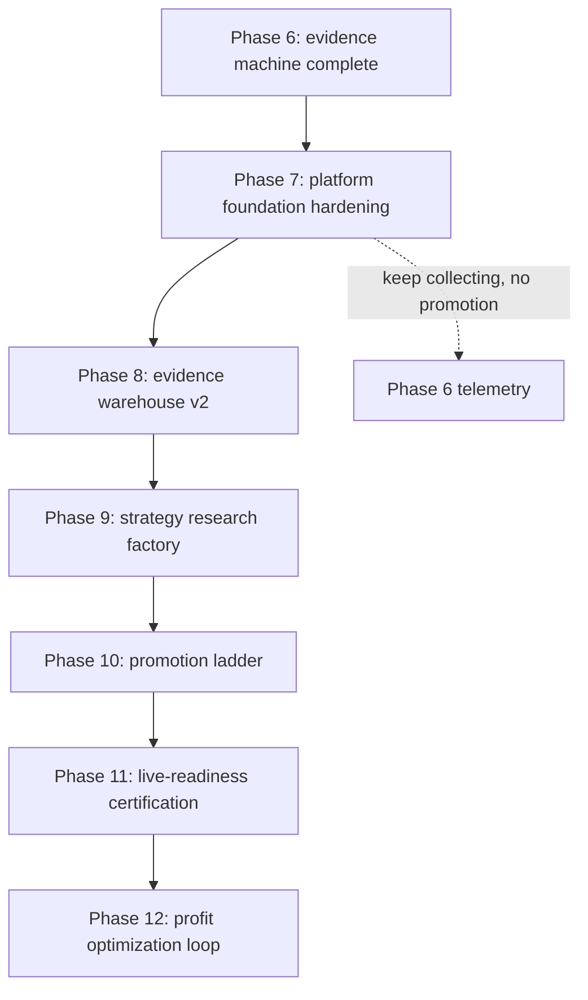

# Phase 7 Platform Foundation Hardening Plan

Generated: 2026-05-06 UTC
Branch: `codex/v13-phase2-expectancy`

## Purpose

Phase 7 is the Track A phase: make the platform boringly stable before we
push strategy logic harder.

The goal is not to add clever trading behavior. The goal is to make every
future trading experiment trustworthy by tightening architecture, tests,
runtime truth, deployment reproducibility, observability, and operating
discipline.

Phase 6 remains active in the background. Strategy evidence telemetry should
continue collecting live paper candidate data, but Phase 7 must not promote
or modify trading behavior unless a task explicitly enters the promotion path.

## Roadmap Position



Phase 7 is primary Track A work. Track B only continues passive data
collection. Track C runs only the minimum operating loop: pre-market health,
intraday no-promotion discipline, and post-close evidence/report generation.

## North Star

By the end of Phase 7, the platform should satisfy this statement:

> A future strategy change can be designed, tested, deployed to paper, observed,
> reverted, and audited without ambiguity about what code ran, what behavior
> changed, what data was collected, and what risk gates were active.

## Non-Goals

- Do not optimize live strategy profitability in Phase 7.
- Do not enable a new candidate filter, ranking rule, sizing rule, or exit rule.
- Do not alter live order submission unless a task is explicitly a safety bug fix.
- Do not expand the lens taxonomy. Collapse and clarify it.
- Do not accept marker-only proof for high-risk behavior.

## Invariants

These must stay true through the entire phase:

- No live exploration execution path.
- Learning mode ignores ML for main-book ranking, confidence, and sizing.
- Learning mode uses fixed ATR-dollar risk sizing, not Kelly.
- Evolution strategy params stay frozen until at least 300 clean post-reset trades.
- Entry path for alpha and pure breakout share the same hard safety gates.
- EOD entry block and flatten remain active.
- Runtime config is snapshotted in every artifact pack.
- Phase 6 telemetry remains advisory/shadow only.
- No secret values are committed.
- The running paper container must match the intended branch/commit after deploy.

## Phase 7 Exit Criteria

Phase 7 is complete only when all are true:

| Area | Exit criterion |
|------|----------------|
| Architecture | Main live-engine responsibilities are mapped and at least the first high-risk extraction is complete with behavior parity. |
| Tests | High-risk marker-only tests are converted or listed with explicit deferral and owner. |
| Safety | Organism, replay, sizing, exits, state, and safety-invariant suites pass. |
| Runtime truth | Git SHA, container `GIT_SHA`, runtime snapshot, audit index, and artifact pack agree. |
| Reproducibility | Docker/config/dependency drift risks are documented and the fresh rebuild path is verified. |
| Observability | Health endpoints and evidence artifacts show strategy PnL, telemetry status, and open risks. |
| Documentation | Architecture and operating docs match actual behavior or explicitly flag gaps. |
| Trading behavior | No unapproved strategy behavior change enters paper/live execution. |

## Work Packages

### P7.0 Baseline Snapshot And Inventory

Purpose: establish the truth before touching structure.

Tasks:

1. Capture repo, branch, HEAD, clean/dirty status, and remote status.
2. Capture live container SHA, image age, env switches, health endpoints, and deploy parity.
3. Capture DB migration head, open positions, broker connection state, and current paper exposure.
4. Capture brain state: manifest, total trades, expectancy, win rate, PnL, latest save time, telemetry files.
5. Run architecture measurements:
   - `_live_tick_inner` LOC.
   - Functions over 150 LOC.
   - Files over target complexity.
   - import graph around organism, brokers, risk, persistence, and API routes.
6. Run test-trust scan:
   - marker-only tests.
   - source-grep tests.
   - tests that assert constants but do not exercise behavior.
   - tests skipped or xfailed.
7. Generate the artifact pack and audit index.

Deliverables:

- `artifacts/phase7/baseline_snapshot.json`
- `artifacts/phase7/god_method_inventory.json`
- `artifacts/phase7/test_trust_inventory.json`
- refreshed `docs/engineering/LIVE_AUDIT_INDEX.md`

Acceptance:

- No code behavior changed.
- Baseline report states what is trusted, what is suspect, and what must be fixed first.

### P7.1 Architecture Map And Ownership Boundaries

Purpose: make the system understandable before refactoring it.

Tasks:

1. Draw the actual runtime flow:
   - scheduler/lifespan startup.
   - market data ingestion.
   - live tick loop.
   - candidate generation.
   - hard safety gates.
   - sizing.
   - order placement.
   - fill reconciliation.
   - exits.
   - brain save/persistence.
   - telemetry and alerts.
2. Map ownership boundaries:
   - `backend/organism/`
   - `backend/brokers/`
   - `backend/integrations/`
   - `backend/risk/`
   - `backend/infra/`
   - API health/admin routes.
   - scripts/artifact/reporting layer.
3. Identify where live behavior is currently coupled:
   - strategy decision mixed with persistence.
   - sizing mixed with order execution.
   - telemetry mixed with decision logic.
   - runtime config scattered across env/defaults/docs.
4. Update architecture documentation only after confirming code reality.

Deliverables:

- `docs/engineering/PHASE7_ARCHITECTURE_BASELINE.md`
- proposed update list for `docs/architecture/mapss.md`

Acceptance:

- Any engineer can follow a tick from market data to order decision to save.
- Known architecture risks are prioritized and tied to files/functions.

### P7.2 Live Engine Decomposition, Behavior-Preserved

Purpose: reduce the blast radius of future strategy work.

Starting target:

- `backend/organism/live_engine.py`
- especially `_live_tick_inner`, candidate handling, safety gates, sizing, telemetry fanout, and reconciliation-adjacent logic.

Principle:

- Extract pure or near-pure helpers first.
- Keep public behavior identical.
- Prefer adapters and data objects over broad rewrites.
- Every extraction must be covered by tests before and after.

Candidate boundaries:

| Boundary | Intended responsibility |
|----------|-------------------------|
| `MarketContext` | Symbol, latest bars, session state, spread/liquidity inputs. |
| `CandidateDecision` | Normalized candidate record before sizing. |
| `SafetyGateResult` | Hard block/pass result with reason and evidence. |
| `SizingDecision` | Shares/notional/risk values before order placement. |
| `ExecutionIntent` | Order-side intent before broker submission. |
| `TelemetryFanout` | Evidence, candidate shadow, audit, and alert dispatch. |

First extraction slice:

1. Isolate candidate telemetry fanout from `_live_tick_inner`.
2. Preserve Phase 5 and Phase 6 telemetry behavior.
3. Add behavioral tests that prove telemetry writes do not alter candidates,
   sizing, gates, or order intent.

Later extraction slices:

1. Safety gate decision object.
2. Sizing decision object.
3. Execution intent creation.
4. Fill reconciliation helper boundaries.
5. Brain-save and telemetry persistence boundary.

Acceptance:

- `_live_tick_inner` LOC decreases without behavior changes.
- Safety/replay suites pass.
- A before/after replay artifact shows no unintended strategy behavior delta.

### P7.3 Test Trust Cleanup

Purpose: make green tests meaningful.

Tasks:

1. Inventory every `tests/test_wave*_fixes.py` and audit-era test.
2. Categorize tests:
   - behavioral.
   - mixed.
   - marker-only.
   - source-grep only.
   - skipped/xfailed.
3. Convert highest-risk marker tests first:
   - auth/JWT behavior.
   - order RBAC.
   - safety gates.
   - kill switch.
   - EOD flatten/block.
   - brain persistence.
   - telemetry preservation.
4. Add mutation-style smoke tests where cheap:
   - changing a gate condition should fail a test.
   - disabling auth should fail a test.
   - bypassing order validation should fail a test.
   - skipping brain telemetry preservation should fail a test.
5. Keep a formal deferral list for anything not converted in Phase 7.

Deliverables:

- `artifacts/phase7/test_trust_inventory.json`
- `docs/engineering/PHASE7_TEST_TRUST_REPORT.md`

Acceptance:

- Critical/high behavior is not proved only by source markers.
- Remaining marker-only tests are low-risk or explicitly deferred.

### P7.4 Runtime Truth And Deployment Parity

Purpose: remove ambiguity about what is actually running.

Tasks:

1. Make deploy verification repeatable:
   - expected git SHA.
   - container `GIT_SHA`.
   - health endpoints.
   - runtime config snapshot.
   - hot-path file parity.
   - telemetry env state.
2. Verify `/healthz`, `/api/v1/health/strategy`, and relevant internal health
   endpoints.
3. Ensure protected endpoints are checked with authenticated probes where needed.
4. Confirm Phase 5 and Phase 6 telemetry files are present or expected to be
   absent until the next candidate.
5. Confirm artifact pack and audit index reflect the same commit.

Deliverables:

- `scripts/ci/verify_paper_runtime.py` or equivalent composed gate.
- `artifacts/phase7/runtime_truth_report.json`

Acceptance:

- One command can answer: "Is the deployed paper system using the code we think it is?"

### P7.5 Reproducibility And Dependency Discipline

Purpose: make rebuilds stable and explainable.

Tasks:

1. Audit Dockerfile base image pinning.
2. Audit `requirements.txt`, `requirements.lock`, lock freshness, and install path.
3. Confirm whether a no-cache rebuild succeeds.
4. Identify floating OS/package inputs.
5. Review `.env` and compose defaults for drift against runtime snapshot.
6. Document exactly what is reproducible today and what is only best-effort.

Deliverables:

- `docs/engineering/PHASE7_REPRODUCIBILITY_REPORT.md`
- optional dependency pinning PR if risk is high and scope is safe.

Acceptance:

- Fresh rebuild risk is quantified.
- Any required pinning changes are isolated and tested.

### P7.6 Observability, Alerts, And Operator View

Purpose: make the platform honest at a glance.

Tasks:

1. Verify visible health data:
   - strategy-only PnL.
   - all-record PnL.
   - open positions.
   - telemetry status.
   - latest brain save.
   - kill-switch config.
   - current code SHA.
2. Verify alerts are either production-exercised or clearly "code-present,
   not production-proven".
3. Make the post-close report surface:
   - what traded.
   - what candidates were rejected.
   - what evidence changed.
   - what must not be promoted.
4. Distinguish operational readiness from profitability readiness.

Deliverables:

- `docs/engineering/PHASE7_OBSERVABILITY_REPORT.md`
- recommended dashboard/API deltas for Phase 8 if needed.

Acceptance:

- A morning check can identify bad deploy, bad config, stale brain, missing telemetry,
  or negative strategy health without reading logs.

### P7.7 Data Integrity And Persistence

Purpose: ensure the brain and database state are trustworthy.

Tasks:

1. Verify audit-log hash chain.
2. Compare realized trades, trade history CSV, manifest totals, and strategy health.
3. Verify outbox depth and age.
4. Verify telemetry and evidence files survive brain saves.
5. Verify backup/snapshot directories are intentional and bounded.
6. Verify reconciliation artifacts are excluded from strategy-only expectancy.

Deliverables:

- `docs/engineering/PHASE7_DATA_INTEGRITY_REPORT.md`
- any cleanup scripts must be read-only first, then explicit backfill PR if needed.

Acceptance:

- Discrepancies are quantified and either fixed or tracked.

### P7.8 Security And Access Control Sanity

Purpose: avoid treating a paper system like a toy.

Tasks:

1. Verify auth login/me/logout behavior.
2. Verify JWT blacklist behavior.
3. Verify admin-only endpoints reject unauthenticated and user-role accounts.
4. Verify debug/test endpoints are not registered in paper runtime.
5. Verify registered users cannot cancel or inspect privileged resources.
6. Confirm secrets are not committed or exposed in generated artifacts.

Deliverables:

- `docs/engineering/PHASE7_SECURITY_SANITY_REPORT.md`

Acceptance:

- No high-risk endpoint relies on source-marker proof only.

### P7.9 Documentation Reconciliation

Purpose: keep docs from becoming decorative.

Tasks:

1. Cross-check architecture docs against code.
2. Cross-check runtime snapshot against documented constants.
3. Cross-check operational runbooks against actual commands and paths.
4. Mark stale docs with owner and required update.
5. Keep a single "current operating truth" document.

Deliverables:

- `docs/engineering/PHASE7_DOCS_DRIFT_REPORT.md`
- updates to docs that are proven stale.

Acceptance:

- The docs a future engineer reads do not contradict the deployed paper system.

## Execution Order

Phase 7 should run in this order:

1. P7.0 baseline snapshot and inventory.
2. P7.1 architecture map.
3. P7.3 test-trust inventory.
4. P7.4 runtime truth gate.
5. P7.2 first behavior-preserved live-engine extraction.
6. P7.5 reproducibility.
7. P7.7 data integrity.
8. P7.8 security sanity.
9. P7.6 observability.
10. P7.9 documentation reconciliation.
11. Final Phase 7 artifact pack, audit index, deploy parity, and phase-close report.

This order front-loads visibility before modification. It also keeps the first
architecture extraction small enough to verify.

## Required Tests And Gates

Minimum checks for any Phase 7 code change touching organism runtime:

```bash
./venv/bin/python -m pytest -q tests/test_organism_live_engine.py --timeout=30
./venv/bin/python -m pytest -q tests/test_organism_engine_scenarios.py --timeout=30
./venv/bin/python -m pytest -q tests/test_multi_tick_state.py --timeout=30
./venv/bin/python -m pytest -q tests/test_safety_invariants.py --timeout=30
./venv/bin/python -m pytest -q tests/test_replay_simulator.py --timeout=30
./venv/bin/python -m pytest -q tests/test_self_evolution.py --timeout=30
```

Config/deploy changes require:

```bash
./venv/bin/python -m pytest -q tests/test_settings_comprehensive.py --timeout=30
./venv/bin/python -m pytest -q tests/test_config_coordinator_comprehensive.py --timeout=30
./venv/bin/python -m pytest -q tests/test_system_integration.py --timeout=30
docker-compose -f docker-compose.paper.yml config
```

Always run before phase-close:

```bash
./venv/bin/python scripts/ci/lint_ratchet.py
./venv/bin/python scripts/ci/verify_findings_ledger.py
./venv/bin/python scripts/ci/forbid_marker_only_critical_high.py
./venv/bin/python scripts/ci/check_deploy_parity.py
INTRA_TASK_ID=phase7-platform-foundation-hardening \
INTRA_TASK_SUMMARY="Phase 7 platform foundation hardening" \
  ./venv/bin/python scripts/ci/generate_artifacts.py full
./venv/bin/python scripts/ci/generate_audit_index.py
```

## Daily Operating Loop During Phase 7

### Pre-Market

1. Verify container and branch/commit.
2. Verify broker connectivity and open positions.
3. Verify kill switches and runtime config snapshot.
4. Verify Phase 5 and Phase 6 telemetry enabled.
5. Verify no unapproved strategy behavior changes are deployed.

### Intraday

1. Do not promote new strategy behavior.
2. Let paper trading and Phase 6 telemetry collect evidence.
3. Only intervene for operational safety issues.

### Post-Close

1. Fetch bars for telemetry.
2. Run Phase 6 warehouse and advisory policy.
3. Record what evidence changed.
4. Keep strategy candidates in `collect`, `reject`, `redesign`, or `eligible_for_replay_review`.
5. Do not promote without replay and review.

## Decision Policy

Phase 7 decisions should be made using this rule:

| Question | Default answer |
|----------|----------------|
| Does this improve mechanical trust? | Do it if scope is small and tests exist. |
| Does this change live strategy behavior? | Defer unless explicitly promoted through evidence gates. |
| Does this reduce ambiguity about runtime truth? | Prioritize it. |
| Does this make tests more behavioral? | Prioritize high-risk surfaces first. |
| Does this only rename/reorganize without reducing risk? | Defer. |
| Does this touch order submission, sizing, exits, or safety gates? | Require replay and safety suite. |

## First Concrete Slice

The first Phase 7 implementation slice should be:

1. Create P7.0 baseline scripts/reports:
   - god-method inventory.
   - test-trust inventory.
   - runtime truth report.
2. Run them against the current branch and paper container.
3. Save baseline reports under `artifacts/phase7/`.
4. Use the baseline to choose the first extraction target.

Expected first extraction:

- Isolate Phase 5/Phase 6 telemetry fanout from `_live_tick_inner`.
- Reason: it is recently changed, observable, testable, and should not alter
  order decisions.
- Success: telemetry remains active, candidate decisions are unchanged, and
  `_live_tick_inner` becomes smaller.

## Open Risks Entering Phase 7

- Current strategy evidence is negative for the main candidate flow.
- `conf_45_55` has positive early evidence but is under-sampled.
- The live engine remains too large and too coupled for fast strategy iteration.
- Some audit-era tests may still prove source shape rather than behavior.
- Docker/base image inputs may still have reproducibility drift.
- Alert wiring may be code-present but not production-proven.
- Documentation may lag the actual runtime after rapid V-series work.

## Phase 7 Close Report

Phase 7 should end with:

- `docs/engineering/PHASE7_CLOSE_REPORT.md`
- refreshed `docs/engineering/LIVE_AUDIT_INDEX.md`
- full artifact pack under `artifacts/`
- Phase 6 post-close evidence report from the latest session
- explicit recommendation for Phase 8 start conditions

The close report must answer:

1. Is the platform technically cleaner than at Phase 7 start?
2. What behavior changed, if any?
3. What risks remain?
4. Are tests more trustworthy?
5. Is paper runtime using the intended code?
6. Is strategy evidence ready for Phase 8 research work?

