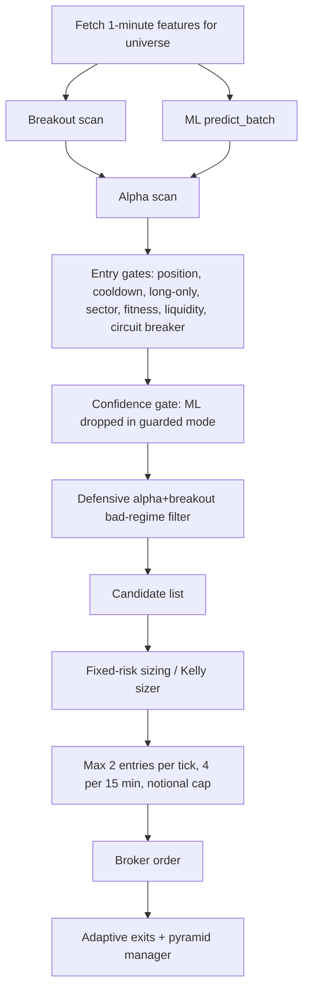

# Strategy Autopsy — Intra Paper Organism

Date: 2026-05-09
Branch: `codex/v13-phase2-expectancy`
Runtime SHA checked during autopsy: `db8675ebd61f0a9d9883dc53e4581e896afc4193`
Primary ledger: `organism_brain/trade_history.csv`
Metrics artifact: `artifacts/strategy_autopsy/strategy_autopsy_metrics.json`

## Executive Verdict

The original strategy was bad enough to justify the user's concern. The clearest evidence is the 149 legacy untagged strategy rows: `-$970.08`, mean `-$6.51/trade`, profit factor `0.498`, and max drawdown about `-$986`. Those rows were not merely "a rough start"; they were a structurally losing system with missing attribution, missing timestamps, and outsized losses.

The current strategy is not the same system, but it is not yet a proven profitable machine. After attribution exists, the tagged ledger is positive: 402 tagged trades, `+$206.90`, mean `+$0.51/trade`, profit factor `1.295`. The May 2026 slice is also positive: 76 trades, `+$77.32`, mean `+$1.02/trade`, profit factor `1.580`. That is real progress, but the sample is small, the edge is concentrated in a few symbols/regimes, and the forward shadow evidence says the current candidate generator is weak in aggregate.

The central strategy problem is not one broken line of code. It is that the live book has been treating a blended composite as a strategy: alpha, breakout, regime, ML confidence, volume/tension, inverse ETFs, and pyramiding all feed the same entry path and then get labeled after the fact. That made the system look like it had a strategy when it actually had several unisolated hypotheses fighting inside one candidate score. The next phase should isolate strategy families, add proper benchmark/null-model comparisons, and promote only sub-strategies that survive shadow, replay, and paper evidence.

## What The Strategy Actually Is

### Live Entry Surface

The currently deployed organism is a 1-minute, long-only paper-trading engine over a seed universe:

`AAPL, MSFT, GOOGL, AMZN, NVDA, META, TSLA, AMD, AVGO, CRM, COST, WMT, LLY, XOM, CAT, SPY, QQQ, IWM, XLK, XLE, SH, PSQ`

Important runtime facts:

- `ORGANISM_LIVE_TIMEFRAME=1Min`
- `ORGANISM_MAX_NOTIONAL=2000`
- `ORGANISM_MAX_POSITIONS=8`
- `ORGANISM_ALPHA_TOP_N=5`
- `ORGANISM_DROP_ML_FROM_GATE=true`
- `ORGANISM_EXPLORATION_ENABLED=false`
- `ORGANISM_CANDIDATE_FILTER_SHADOW_TELEMETRY_ENABLED=true`
- `ORGANISM_STRATEGY_EVIDENCE_TELEMETRY_ENABLED=true`
- `ORGANISM_ALPHA_BREAKOUT_BAD_REGIME_FILTER_ENABLED=true`

The system can scan broader market candidates with `MarketScanner`, but the live trade history still mostly reflects the seed universe plus whatever survived rotation. The scanner is infrastructure, not yet a demonstrated alpha source.

### Alpha Scanner

Source: `backend/organism/alpha_scanner.py`

`AlphaScanner` builds a composite score from:

| Component | Normal weight |
| --- | ---: |
| ML score | 25% |
| Breakout readiness/squeeze | 20% |
| Institutional accumulation | 15% |
| Cross-sectional momentum rank | 15% |
| Momentum quality | 10% |
| Volume/price divergence | 10% |
| Regime alignment | 5% |

In learning or guarded mode, ML weight is forced to zero and its weight is reallocated mostly to breakout and momentum. That is the correct defensive posture because prior audits found ML confidence to be anti-predictive or uncalibrated.

The weakness: regime alignment is only 5% of the alpha composite. Before the May 8 defensive gate, a candidate could still pass in chop or trending-down regimes if other ingredients looked strong enough. That is exactly the bad sub-slice now blocked for `alpha+breakout` in `chop` and `trending_down`.

### Breakout Scanner

Source: `backend/organism/breakout_scanner.py`

`BreakoutScanner` scores:

| Component | Weight |
| --- | ---: |
| Bollinger/Keltner squeeze | 25% |
| Volume surge | 25% |
| Range contraction | 15% |
| Relative strength | 15% |
| Pivot breakout | 15% |
| Institutional flow | 5% |

The threshold is intentionally low for intraday trading: `MIN_BREAKOUT_SCORE = 0.20`, with individual scoring accepting composites from `0.15`. That increases opportunity count but also means weak pattern evidence can reach later gates unless the confidence/regime gates catch it.

### Live Candidate Pipeline

Source: `backend/organism/live_engine.py`

The current entry path is:



Current live alpha confidence in guarded/ML-isolated mode is effectively:

`0.65 * breakout_score + 0.35 * tension`

The reported `entry_source` is inferred late:

- `breakout` if `breakout_score >= 0.55` and predicted return is near zero.
- `alpha+breakout` if `breakout_score >= 0.40`.
- `alpha` otherwise.
- ORB/EOD/MR can override the source, but they are feature-flagged off by default.

This is not a true strategy ID. It is a heuristic attribution label. That matters because "alpha", "breakout", and "alpha+breakout" are not independent strategy implementations with separate state, risk, thresholds, and promotion records. They are labels on one blended candidate pipeline.

### Sizing And Exposure

Source: `backend/organism/kelly_sizer.py`

In guarded mode, the platform uses fixed ATR-dollar risk sizing, not full Kelly. Runtime max notional is `$2,000/trade`; with 8 max positions, max gross notional is about `$16,000` on roughly `$111,500` equity, before actual position sizing and throttle effects.

This is important for the user's "beat the index" concern. Even a positive intraday edge will not outperform a strong index day in account-level return if it uses only a small fraction of capital. On May 8, QQQ gained about `+1.576%` regular-session open-to-close in the cached bar data, while the organism lost `-$23.79`, about `-2.13 bp` on `$111.5k` equity. The strategy was both directionally wrong that day and too lightly exposed to ever look like a high-return engine.

### Exit Engine

Source: `backend/organism/adaptive_exits.py`

The exit engine is more coherent than the entry engine. It uses ATR-based stops, take-profit R multiples, trailing stops, max-hold windows, failure-to-follow logic, EOD flattening, and pyramid cuts. The best-performing exit categories are trades that survive long enough to reach max-hold or horizon-timeout exits. The worst categories are early loss-control exits and legacy stops.

This does not mean "just hold longer." Holding time is endogenous: bad entries exit early because they fail. It means the entry engine is often producing candidates that do not confirm quickly enough.

## Empirical Record

All figures below exclude reconciliation artifacts. Source artifact: `artifacts/strategy_autopsy/strategy_autopsy_metrics.json`.

### Ledger Split

| Slice | Trades | PnL | Mean/trade | Win rate | Profit factor | Max drawdown |
| --- | ---: | ---: | ---: | ---: | ---: | ---: |
| All strategy rows | 551 | `-$763.18` | `-$1.39` | 33.21% | 0.710 | `-$985.93` |
| Legacy untagged | 149 | `-$970.08` | `-$6.51` | 40.27% | 0.498 | `-$986.14` |
| Tagged only | 402 | `+$206.90` | `+$0.51` | 30.60% | 1.295 | `-$211.40` |
| Since 2026-04-15 | 311 | `-$3.76` | `-$0.01` | 32.48% | 0.992 | `-$106.35` |
| May 2026 | 76 | `+$77.32` | `+$1.02` | 35.53% | 1.580 | `-$46.66` |
| Last 100 | 100 | `+$49.75` | `+$0.50` | 34.00% | 1.276 | `-$46.66` |
| Last 50 | 50 | `+$15.72` | `+$0.31` | 36.00% | 1.152 | `-$38.40` |
| Last 25 | 25 | `+$32.52` | `+$1.30` | 28.00% | 1.752 | `-$38.40` |

Interpretation:

- The pre-attribution strategy was materially bad.
- The post-attribution strategy is no longer obviously broken, but its edge is thin, concentrated, and not yet robust.
- Win rate is structurally low; the system needs winners to be materially larger than losers. That only happens in some slices.

### Entry Source

| Entry source | Trades | PnL | Mean/trade | Win rate | Profit factor |
| --- | ---: | ---: | ---: | ---: | ---: |
| Legacy untagged | 149 | `-$970.08` | `-$6.51` | 40.27% | 0.498 |
| Alpha | 220 | `+$178.02` | `+$0.81` | 28.64% | 1.408 |
| Alpha+breakout | 162 | `+$15.20` | `+$0.09` | 32.10% | 1.063 |
| Breakout | 20 | `+$13.68` | `+$0.68` | 40.00% | 1.622 |

Alpha appears positive after tagging, but that label is broad. `alpha+breakout` is barely positive overall and has clearly bad regimes. Pure breakout is promising but only 20 trades.

### Entry Source By Regime

| Slice | Trades | PnL | Mean/trade | Win rate | Profit factor |
| --- | ---: | ---: | ---: | ---: | ---: |
| Alpha+breakout in chop | 133 | `-$62.47` | `-$0.47` | 30.83% | 0.689 |
| Alpha+breakout in trending_down | 7 | `-$9.82` | `-$1.40` | 0.00% | 0.000 |
| Alpha+breakout in trending_up | 8 | `-$5.82` | `-$0.73` | 37.50% | 0.484 |
| Breakout in chop | 14 | `-$0.90` | `-$0.06` | 35.71% | 0.925 |
| Breakout in trending_up | 6 | `+$14.58` | `+$2.43` | 50.00% | 2.448 |
| Alpha in chop | 213 | `+$92.73` | `+$0.44` | 28.17% | 1.235 |
| Alpha in trending_up | 7 | `+$85.29` | `+$12.18` | 42.86% | 3.071 |
| Alpha+breakout in high_vol | 14 | `+$93.30` | `+$6.66` | 57.14% | 5.650 |

This is the most important empirical table. The bad-regime alpha+breakout filter was justified. What remains unresolved is whether `alpha+breakout` in high-volatility is a real edge or a small-sample artifact. It should not be generalized from 14 trades.

### Confidence Quality

| Confidence bucket | Trades | PnL | Mean/trade | Win rate | Profit factor |
| --- | ---: | ---: | ---: | ---: | ---: |
| `<0.40` | 212 | `-$230.25` | `-$1.09` | 33.49% | 0.713 |
| `0.40-0.45` | 39 | `+$25.24` | `+$0.65` | 17.95% | 1.131 |
| `0.45-0.55` | 56 | `-$37.96` | `-$0.68` | 30.36% | 0.784 |
| `0.55-0.65` | 172 | `-$516.07` | `-$3.00` | 33.72% | 0.533 |
| `0.65-0.75` | 62 | `+$34.45` | `+$0.56` | 45.16% | 1.110 |
| `>=0.75` | 10 | `-$38.59` | `-$3.86` | 20.00% | 0.116 |

Confidence is not a calibrated probability. Correlations from the ledger:

- `confidence_vs_pnl = -0.0041`
- `confidence_vs_actual_return = 0.0049`
- `predicted_return_vs_actual_return = 0.0302`
- `predicted_return_vs_pnl = 0.0318`

The live system is correct to keep ML out of sizing/ranking promotion until confidence calibration improves. The current confidence field is useful as a gating/telemetry feature only after slice-specific validation; it is not an edge estimate.

### Exit Reason

Worst all-time exit drags:

| Exit reason | Trades | PnL | Mean/trade | Win rate |
| --- | ---: | ---: | ---: | ---: |
| Stop loss | 131 | `-$602.21` | `-$4.60` | 25.95% |
| Failure to follow | 93 | `-$312.06` | `-$3.36` | 23.66% |
| Trailing stop | 44 | `-$196.51` | `-$4.47` | 29.55% |
| Max loss limit | 7 | `-$188.76` | `-$26.97` | 28.57% |
| Pyramid cuts, aggregated in manifest | 146 | `-$427.06` | `-$2.93` | 0.68% |

Best all-time exit contributors:

| Exit reason | Trades | PnL | Mean/trade | Win rate |
| --- | ---: | ---: | ---: | ---: |
| Max holding period | 70 | `+$313.76` | `+$4.48` | 90.00% |
| ML reversal | 26 | `+$189.40` | `+$7.28` | 69.23% |
| Horizon timeout | 12 | `+$159.15` | `+$13.26` | 91.67% |
| EOD flatten | 6 | `+$76.92` | `+$12.82` | 100.00% |
| Take profit | 8 | `+$54.24` | `+$6.78` | 87.50% |

The exit engine is acting as a filter: low-quality entries die through stop/FTF/pyramid-cut pathways, while the few trades that survive into the intended holding window pay for many losers. That shape can be profitable, but only if entry quality is improved enough that early losses do not overwhelm the right tail.

### Holding-Time Shape

| Holding bucket | Trades | PnL | Mean/trade | Win rate | Profit factor |
| --- | ---: | ---: | ---: | ---: | ---: |
| Unknown legacy | 142 | `-$944.75` | `-$6.65` | 40.14% | 0.504 |
| `<5m` | 66 | `-$89.66` | `-$1.36` | 7.58% | 0.669 |
| `5-15m` | 183 | `-$268.40` | `-$1.47` | 12.02% | 0.196 |
| `15-30m` | 144 | `+$404.69` | `+$2.81` | 61.11% | 4.874 |
| `30-60m` | 12 | `+$14.18` | `+$1.18` | 58.33% | 1.689 |
| `>=60m` | 4 | `+$120.75` | `+$30.19` | 100.00% | 999 |

Do not read this as "force every trade to hold 15 minutes." It means entries that cannot survive 5-15 minutes are usually bad. The strategy needs better entry confirmation or a separate scalp strategy with different targets and stops.

### Time Of Day

By exit hour, the strongest buckets are:

- `12:00-13:00 ET`: 81 trades, `+$218.18`, mean `+$2.69`.
- `15:45-close`: 14 trades, `+$56.91`, mean `+$4.07`.
- `15:00-15:45`: 46 trades, `+$19.46`, mean `+$0.42`.

The weakest post-timestamp buckets:

- `11:00-12:00 ET`: 81 trades, `-$66.64`.
- `14:00-15:00 ET`: 61 trades, `-$19.74`.
- `10:00-11:00 ET`: 60 trades, `-$10.39`.

The late-day/eod evidence is interesting, and it lines up with academic intraday-seasonality work, but the live EOD strategy is still feature-flagged off. It should be researched deliberately, not accidentally inferred from mixed exits.

### Symbol Concentration

Best all-time symbol contributors:

| Symbol | Trades | PnL | Mean/trade | Win rate | Profit factor |
| --- | ---: | ---: | ---: | ---: | ---: |
| XLK | 34 | `+$226.59` | `+$6.66` | 41.18% | 5.654 |
| NVDA | 50 | `+$125.15` | `+$2.50` | 44.00% | 3.023 |
| AMZN | 29 | `+$78.96` | `+$2.72` | 34.48% | 2.196 |
| QQQ | 66 | `+$69.82` | `+$1.06` | 31.82% | 1.809 |
| AMD | 20 | `+$62.40` | `+$3.12` | 40.00% | 1.746 |

Worst all-time symbol contributors:

| Symbol | Trades | PnL | Mean/trade | Win rate | Profit factor |
| --- | ---: | ---: | ---: | ---: | ---: |
| SNOW | 3 | `-$310.06` | `-$103.35` | 0.00% | 0.000 |
| WMT | 17 | `-$219.06` | `-$12.89` | 35.29% | 0.100 |
| AVGO | 26 | `-$203.45` | `-$7.82` | 23.08% | 0.283 |
| COIN | 12 | `-$108.20` | `-$9.02` | 41.67% | 0.570 |
| UBER | 3 | `-$85.45` | `-$28.48` | 0.00% | 0.000 |

This is another sign that the fixed/seed universe matters. Recent positive May results leaned heavily on AMD/NVDA/IWM, while May losers included CRM, TSLA, AVGO, GOOGL, and AMZN. A personal hedge-fund-grade platform should not rely on "AMD happened to rip." It should identify why AMD was tradable that day, whether the same condition was visible before entry, and whether the same rule works across many stocks-in-play.

## Shadow Evidence

Phase 6 evidence warehouse:

- Telemetry rows: 195
- Joined outcome rows: 579
- Primary horizon: 5 bars
- Recommendation: `insufficient_shadow_sample`

Advisory policy highlights:

| Filter | Events | Mean 5-bar directional bps | Win rate | Advisory action |
| --- | ---: | ---: | ---: | --- |
| all_candidates | 195 | `-0.5614` | 47.15% | reject_or_redesign |
| alpha_breakout_chop | 136 | `-1.2884` | 49.26% | reject_or_redesign |
| alpha_breakout_chop_or_trending_down | 68 | `+0.8647` | 51.47% | reject_or_redesign |
| conf_45_55 | 40 | `-5.0531` | 30.00% | reject_or_redesign |
| conf_55_65 | 32 | `+0.6602` | 43.75% | reject_or_redesign |
| inverse_etf_alpha_breakout | 28 | `+0.3699` | 42.86% | collect_more_shadow_sample |

The shadow layer did exactly what we needed it to do: it found a bad candidate slice before we generalized from anecdotes. It justified the May 8 defensive filter against `alpha+breakout` in chop/trending-down. But it also says the current candidate stream as a whole is not an alpha engine yet.

No post-filter paper session has occurred yet. The next paper session is the first real test of the defensive gate.

## Strategy Feasibility Against External Evidence

This autopsy does not assume the current strategy family is impossible. Momentum, intraday continuation, opening-range dynamics, and short-horizon reversal all have documented evidence in the literature. The problem is that the implementation must be much more precise than a blended score.

Relevant sources:

- Heston, Korajczyk, and Sadka, "Intraday Patterns in the Cross-Section of Stock Returns" (Journal of Finance, 2010): documents recurring intraday cross-sectional return patterns. This supports researching time-of-day and intraday continuation, not a generic always-on composite.
- Jegadeesh, "Evidence of Predictable Behavior of Security Returns" (Journal of Finance, 1990), and Lehmann, "Fads, Martingales, and Market Efficiency" (Quarterly Journal of Economics, 1990): support short-horizon reversal as a phenomenon, but also warn that it is microstructure-sensitive.
- Korajczyk and Sadka, "Are Momentum Profits Robust to Trading Costs?" (Journal of Finance, 2004): transaction costs and capacity matter. Intraday edges must survive spread, slippage, and turnover.
- Chague, De-Losso, and Giovannetti, "Day Trading for a Living?" documents how hard retail-style day trading is in practice. This is a useful base-rate warning: execution and discipline are not side details.
- Barbon/Zarattini/Aziz ORB work and related SSRN literature suggest opening-range breakout can be viable in specific setups, but that is not the same as saying a generic breakout score works across a static mega-cap universe.

Practical implication: the platform should not try to "be creative" by mixing every plausible alpha in one score. It should run separate research lines:

- ORB/stocks-in-play continuation.
- Late-day momentum / intraday seasonal continuation.
- Mean reversion in confirmed chop.
- News/earnings/catalyst momentum.
- Index/inverse-ETF hedging.
- Existing alpha scanner as a baseline, not as the master strategy.

## Fundamental Flaws

### 1. The Strategy Is Over-Bundled

The live strategy is a composite of multiple hypotheses:

- Cross-sectional momentum.
- Breakout readiness.
- Squeeze/volatility compression.
- Volume/institutional accumulation proxies.
- ML confidence.
- Regime alignment.
- Inverse ETF regime flips.
- Pyramiding.

Those hypotheses do not have the same ideal market, holding time, stop logic, or validation method. A mean-reversion idea in chop and a breakout idea in expansion should not share one generic score and one generic source label.

### 2. Attribution Is Too Late

`entry_source` is inferred after sizing from breakout score and predicted return. That is useful, but not strong enough for strategy governance. The system needs a first-class `strategy_id` assigned before ranking/sizing:

- `alpha_momentum`
- `alpha_breakout`
- `pure_breakout`
- `orb_sip`
- `eod_momentum`
- `mean_reversion`
- `inverse_index_hedge`
- `candidate_rejected_shadow`

Each `strategy_id` should have its own thresholds, promotion status, risk cap, telemetry, replay report, and daily attribution.

### 3. Regime Was Underweighted

The alpha scanner's regime alignment is only 5%. That allowed momentum/breakout candidates in regimes where their thesis was weak. The new May 8 defensive filter is the right first correction, but the deeper fix is to make regime a strategy selector, not a tiny score term.

### 4. Confidence Is Not Edge

Confidence and predicted return have near-zero correlation with outcome in the current ledger. The system has already reacted by dropping ML from the gate and keeping fixed-risk sizing. Keep that. Do not promote ML influence until there is out-of-sample evidence with calibration, Brier/log-loss style quality, and monotonic expectancy by confidence bucket.

### 5. Fixed Universe Is Not Enough

The universe has good names, but a high-profit intraday system usually needs a mechanism for "stocks in play": earnings, gaps, abnormal volume, news, sector shocks, index trend, and liquidity/spread filters. The scanner exists, but the strategy evidence still needs to prove it changes trade selection profitably.

### 6. Paper PnL Is Not Benchmark-Adjusted

Daily reports show PnL, but the research loop must compare:

- Strategy vs QQQ/SPY/IWM buy-and-hold for the same day.
- Strategy vs same-symbol buy-and-hold over the trade window.
- Strategy vs random entries with same symbol/time/hold distribution.
- Strategy vs "do nothing" after costs.

Without those baselines, a positive day may simply be beta, and a negative day may hide alpha in a bad market.

### 7. Account-Level Return And Strategy-Level Edge Are Being Confused

The platform uses low notional caps and fixed ATR risk. That is correct for paper validation and safety. But it means the account will not beat strong index days even if per-trade expectancy is slightly positive. To become a high-profit machine, the system must first prove edge, then scale exposure under drawdown and liquidity controls.

## What It Does Well

- The technical platform now captures enough attribution to conduct real strategy research.
- Reconciliation artifacts are excluded from strategy health.
- Exploration execution is disabled.
- ML is correctly isolated from live main-book sizing/ranking in guarded mode.
- Fixed-risk sizing prevents an unproven model from overbetting.
- Shadow telemetry is working and already produced a useful live behavior change.
- Recent tagged and May slices are not uniformly bad; the platform has recoverable signal pockets.

## What It Does Poorly

- It treats a blended candidate score as if it were a strategy.
- It cannot yet explain why a winning slice wins in causal terms.
- It still overtrades `alpha+breakout`-like signals unless gated by regime.
- It does not yet benchmark itself against passive index exposure or null models.
- It lacks clean live trade attribution for true strategy families.
- It has too little post-filter paper data to promote or scale anything.
- It can look busy while producing no account-level alpha because exposure is intentionally small.

## Answer To The Core Question

Is the original strategy bad?

Yes. The legacy, untagged strategy record is severely negative and operationally opaque. That original phase should be treated as failed research, not as evidence to average into future confidence.

Is the current strategy bad?

Not proven bad as a whole, but not proven good either. The tagged record and May record show improvement, while shadow evidence says the current candidate generator is weak in aggregate and some sub-slices are bad. The right posture is not despair and not optimism. The current strategy is a baseline candidate generator under probation.

Does it have legs?

Potentially, but only if we decompose it. The strongest path is not "tune the composite harder"; it is to turn the platform into a strategy evidence machine where each alpha family earns capital allocation independently.

## Immediate Strategy Recommendations

1. Keep the May 8 defensive filter live:
   - Block `alpha+breakout` in `chop` and `trending_down`.
   - Continue recording blocked candidates as shadow evidence.

2. Do not promote ML influence:
   - Keep `DROP_ML_FROM_GATE=true`.
   - Keep guarded/fixed-risk behavior until confidence has monotonic out-of-sample evidence.

3. Add first-class `strategy_id`:
   - Assign before ranking/sizing.
   - Persist on candidate telemetry, trade metadata, CSV, manifest, daily reports, and health endpoints.

4. Split promotion ledgers:
   - Each `strategy_id` gets own PnL, win rate, profit factor, drawdown, MFE/MAE, slippage estimate, and benchmark/null comparison.

5. Build null-model and benchmark reports:
   - Same symbol/time buy-and-hold.
   - QQQ/SPY/IWM same-day return.
   - Random entry same symbol/time bucket.
   - Same candidates but delayed 1/5/10 bars.

6. Research ORB/EOD/MR in shadow, not live:
   - ORB and EOD have better theoretical support than the current generic blend, but they need evidence.
   - Mean reversion should be a separate chop-only strategy, not a tiny score adjustment.

7. Add stocks-in-play selection:
   - Earnings/gap/relative volume/news/movers should drive candidate universe.
   - Static universe should remain as a liquidity-safe fallback.

8. Introduce promotion tiers:
   - Tier 0: shadow only.
   - Tier 1: replay eligible.
   - Tier 2: micro paper live, tiny notional.
   - Tier 3: normal paper live.
   - Tier 4: real-capital eligible.

9. Keep exposure small until evidence exists:
   - Do not increase max notional merely to chase index returns.
   - Scale only after edge survives costs, benchmark comparisons, and post-filter paper sessions.

10. Treat next full trading day as the first post-filter validation day:
    - The key question is whether removing bad-regime `alpha+breakout` improves trade quality without deleting the few positive high-volatility opportunities.

## Proposed Next Implementation Slice

### Slice S1 — Strategy Attribution Hardening

Goal: make every trade answer "which actual strategy caused this?"

Changes:

- Add `strategy_id` to candidate dicts.
- Add `strategy_id` to `PositionSize`.
- Persist `strategy_id` into `_entry_metadata`.
- Save `strategy_id` into `TradeRecord` and `trade_history.csv`.
- Add report segmentation by `strategy_id`.
- Keep `entry_source` as backward-compatible display label.

Tests:

- Unit tests for alpha, pure breakout, ORB, EOD, MR attribution.
- Behavioral live-engine scenario confirming `strategy_id` survives order creation and trade recording.
- CSV persistence/load round-trip.

No live behavior change.

### Slice S2 — Benchmark And Null Model Research Report

Goal: stop confusing "made money" with "had edge."

Changes:

- Post-close script joins closed trades to cached bars.
- Computes same-symbol trade-window return, SPY/QQQ/IWM daily return, and random-entry baseline.
- Adds `alpha_over_symbol_hold`, `alpha_over_index_day`, and `alpha_over_random`.

No live behavior change.

### Slice S3 — Shadow Strategy League Table

Goal: decide what deserves capital.

Changes:

- Generate daily strategy table:
  - live trades by `strategy_id`
  - shadow candidates by `strategy_id`
  - 1/5/10-bar forward returns
  - replay eligibility
  - promote/demote/collect-more status

No live behavior change.

### Slice S4 — Candidate Generator Redesign

Goal: replace "one composite" with independent engines.

Candidate engines:

- ORB stocks-in-play.
- EOD momentum.
- Mean reversion in chop.
- Existing alpha scanner as `alpha_baseline`.
- Index/inverse hedge as separate guarded strategy.

Promotion requires replay and paper evidence.

## Deep Research Prompt

Use this prompt in external research if desired:

```text
We run a paper-traded intraday US equities platform called Intra. The current live strategy operates on 1-minute bars over a seed universe of large-cap stocks and ETFs: AAPL, MSFT, GOOGL, AMZN, NVDA, META, TSLA, AMD, AVGO, CRM, COST, WMT, LLY, XOM, CAT, SPY, QQQ, IWM, XLK, XLE, SH, PSQ.

The live candidate engine blends multiple signals:
- ML prediction confidence/return, currently isolated from live gating because historical confidence was not predictive.
- Breakout readiness: squeeze, range contraction, pivot breakout, volume surge, relative strength.
- Cross-sectional momentum.
- Institutional accumulation/volume-price divergence proxies.
- Regime alignment.
- Stocks-in-play boost from relative volume and gap.

Runtime posture:
- 1-minute bars.
- Long-only.
- Fixed ATR-dollar risk sizing in guarded mode.
- Max notional currently $2,000/trade, max 8 positions.
- Exploration execution disabled.
- ORB/EOD/mean-reversion live flags off; those are shadow/research candidates.
- A defensive filter now blocks alpha+breakout candidates in chop and trending_down regimes.

Empirical paper-trading record:
- All strategy rows: 551 trades, -$763.18, win rate 33.21%, profit factor 0.710.
- Legacy untagged rows: 149 trades, -$970.08, profit factor 0.498.
- Tagged rows after attribution: 402 trades, +$206.90, win rate 30.60%, profit factor 1.295.
- May 2026: 76 trades, +$77.32, win rate 35.53%, profit factor 1.580.
- Bad slice: alpha+breakout in chop, 133 trades, -$62.47, profit factor 0.689.
- Bad slice: alpha+breakout in trending_down, 7 trades, -$9.82, 0% win rate.
- Promising but small slice: alpha+breakout in high_vol, 14 trades, +$93.30, profit factor 5.650.
- Confidence is not calibrated: confidence_vs_pnl correlation -0.0041; predicted_return_vs_actual_return 0.0302.
- Shadow evidence: all candidates at 5-bar horizon had mean -0.5614 bps and 47.15% win rate; alpha_breakout_chop had -1.2884 bps and 49.26% win rate.

Question:
1. Which strategy families are academically and practically plausible for 1-minute US equity paper/live trading after transaction costs?
2. Is a blended composite of breakout/momentum/volume/regime/ML likely to be inferior to separate strategy engines?
3. What validation protocol should be required before promoting ORB, EOD momentum, mean reversion, inverse ETF hedging, or the current alpha scanner?
4. What benchmark and null models should be used to distinguish real alpha from market beta, symbol selection luck, and time-of-day effects?
5. What changes would you prioritize to turn this into a profitable autonomous trading research platform without overfitting?
```

## Sources For External Feasibility

- Heston, Korajczyk, Sadka, "Intraday Patterns in the Cross-Section of Stock Returns", Journal of Finance, 2010: https://ideas.repec.org/a/bla/jfinan/v65y2010i4p1369-1407.html
- Heston, Korajczyk, Sadka arXiv mirror: https://arxiv.org/abs/1005.3535
- Jegadeesh, "Evidence of Predictable Behavior of Security Returns", Journal of Finance, 1990: https://www.jstor.org/stable/2328716
- Lehmann, "Fads, Martingales, and Market Efficiency", Quarterly Journal of Economics, 1990: https://academic.oup.com/qje/article-abstract/105/1/1/1865783
- Korajczyk and Sadka, "Are Momentum Profits Robust to Trading Costs?", Journal of Finance, 2004: https://papers.ssrn.com/sol3/papers.cfm?abstract_id=305282
- Chague, De-Losso, Giovannetti, "Day Trading for a Living?": https://papers.ssrn.com/sol3/papers.cfm?abstract_id=3423101
- Barbon/Zarattini/Aziz opening-range-breakout research reference: https://papers.ssrn.com/sol3/papers.cfm?abstract_id=4729284

## Bottom Line

The platform is now technically capable of learning. The strategy is not yet a hedge-fund-grade profit engine. The right next move is not another broad cleanup pass and not a blind search for a magic stock. The right next move is strategy separation plus evidence discipline: isolate each idea, benchmark it, shadow it, replay it, then promote only the pieces that survive.
