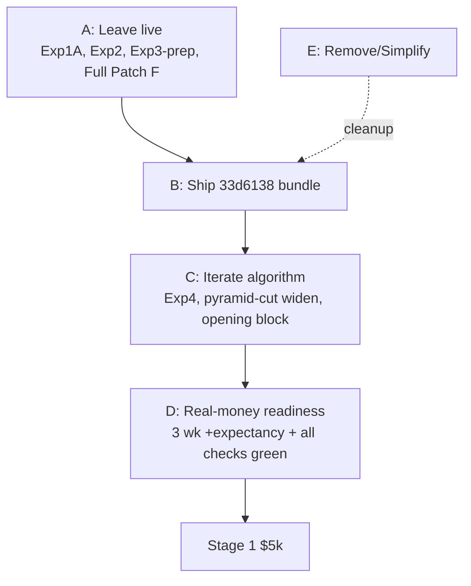

# Master Action Matrix

**Date**: 2026-04-23 | **Live**: `ce06d41` | **HEAD**: `33d6138`

Strict, mutually-exclusive buckets. Each item has a rationale and is tied back to the Issue Ledger where applicable.

---

## A. LEAVE LIVE NOW

These are running in `ce06d41` and should continue running.

| Item | Why |
|---|---|
| **Exp1A** — chop-regime minimum-hold gate for `pyramid_cut` (`ab54b2f`) | Cut pyramid_cut share from 56% → 33% on Apr-21 session. Continue to collect post-300 data. |
| **Exp2** — suppress inverse-ETF entries in chop (`d79cae0`) | Eliminated 0%-wr PSQ/SH trades. Gate lifts automatically in trending_down. |
| **Exp3 prep** — confidence inversion side-by-side logging (`ce06d41`) | Instrumentation-only; needed to validate or falsify the ML-contamination hypothesis across more sessions. |
| **Full Patch F** persistence hardening (F1–F4 + F-lite) | No brain wipes in 5-session window. The platform's durable spine. |
| **Walk-forward + split persistence** | Trades persist even when gate BLOCKS promotion. |
| **Unified entry gates** (`_passes_entry_gates`) | Single path — do not re-fragment. |
| **Universe 22 symbols** incl. SH, PSQ (with Exp2 gate) | Stable; breadth adequate (12/22 traded). |
| **`ALPHA_TOP_N=5`** (separate from `MAX_OPEN_POSITIONS=8`) | H7 separation is correct; do not re-merge. |
| **Production confidence blend** (trade 370 > 200) | Active and contributing — pattern weakened the inversion hypothesis on Apr-21. |
| **Reconciliation hardening** (stale-fill, cost-weighted avg, broker-sync) | Working across 5 sessions. |
| **EOD flatten at 15:58 ET** | Working every session. |
| **Governance halt / freeze / drawdown_kill runtime logic** | Live; only kill-pct value is a P0 decision (I-02). |
| **Paper mode operational pause** | Declared post-close; respected by not POSTing to organism routes. |

---

## B. SHIP NEXT (after worktree is resolved)

One atomic deploy of the full hardening bundle. **All items ship together** — the commits depend on each other for coherent risk semantics.

| Item | Commit | Notes |
|---|---|---|
| **G1** — exit-level restore warning | `15cc0a4` | Part of mechanical bundle |
| **G2** — cooldown-on-success-only | `15cc0a4` | Avoid cooldown on failed entries |
| **G3** — NaN pyramid guard | `15cc0a4` | Silent-failure defensive guard |
| **H1** — production risk-budget cap | `679ffd2` | Real-money risk cap |
| **H2** — feature drift guard | `679ffd2` | Drift event → alert |
| **H5 API** — settings API enforces frozen/halted | `c306074` | Prevents out-of-band resumes |
| **Per-trade notional + daily max-loss circuit breaker** | `bb5cbb5` | **env-gated; SET envs before deploy** |
| **Slack/webhook alerting** | `33d6138` | **set `SLACK_WEBHOOK_URL`** |

### Prerequisites (deploy-gate)

1. **Resolve worktree** — I-01. `git restore` to HEAD (recommended) OR commit reverts intentionally.
2. **Set risk envs in `.env`** —
   - `ORGANISM_MAX_NOTIONAL=2500` (per-trade cap)
   - `ORGANISM_MAX_DAILY_LOSS=500` (daily circuit breaker)
3. **Set `SLACK_WEBHOOK_URL`** in `.env` (validate webhook with a test message)
4. **Decide drawdown_kill_pct** — I-02. Recommend 0.10 as interim; ship with a startup validator.
5. **Rebuild image** from `33d6138` (HEAD). Verify container file-hash fingerprint matches `33d6138`, not some intermediate.
6. **Pre-open diagnostic pass** via nightly_scheduler.

### Post-deploy verification

- `GET /health` should include commit SHA (add `/app/VERSION` write step at image build).
- Trigger a staged "critical" event (e.g., force a save-guard fire in a dev harness, NOT live) and confirm Slack message.
- Confirm `governance_state.json` unchanged (halt=false, freeze=false).
- Confirm 1–2 trading sessions produce normal trades with both new risk caps in place (and neither is tripped by a normal session).

---

## C. PREPARE OFFLINE (next 1–2 weeks)

These are algorithmic changes to iterate toward positive expectancy. Prepare but do not ship until after 5–10 sessions of hardening-bundle observation.

| Item | Expected impact | Risk | Source |
|---|---|---|---|
| **Exp4 un-revert + deploy** (chop-trail widen to 5× ATR or disable) | $50–195 recovered MFE over comparable 5-session window | Low (reverses easily) | `b97f903` un-revert + I-04 |
| **Widen chop pyramid_cut adverse threshold** beyond Exp1A (e.g., from −1.0R to −2.5R in chop) | $30–65 improvement (baseline report ranked this #1) | Medium (larger per-trade losses when stops hit; partially mitigated by min-hold) | `TRADING_EDGE_BASELINE_REPORT §TOP 3 #1` |
| **Opening-range block 30→60 min** (9:30→10:30 ET) | ~$15 improvement from eliminating 0%-wr first-hour | Low | Baseline report #3 |
| **Calibration persistence across retrains** | Stabilizes `effective_confidence`; impact unknown | Low | I-13 |
| **Unify confidence authority** (ml_signal as single source) | Architectural hygiene; prevents future drift | Low | I-08 |
| **Unify learning-mode threshold** | Architectural hygiene | Low | I-10 |
| **Remove exploration dead code** | Removes 20–40 lines of misleading code | None | I-09 |
| **Config manifest + startup validator** | Prevents future env/default inversions | Low | I-20 |

---

## D. FIX BEFORE REAL MONEY

All items in B plus the following. No Stage-1 tick should occur until every row below is green.

| Check | Evidence | Owner |
|---|---|---|
| Worktree clean at HEAD `33d6138` | `git status` empty | eng |
| Image fingerprint matches HEAD `33d6138` | `/app/VERSION` endpoint | eng |
| Drawdown-kill decision applied + validator warns on >1.5× deviation | startup log | eng |
| `ORGANISM_MAX_DAILY_LOSS` > 0 in live env | `docker exec env` | eng |
| `ORGANISM_MAX_NOTIONAL` > 0 in live env | `docker exec env` | eng |
| `SLACK_WEBHOOK_URL` set AND tested | Slack receipt | eng |
| 3 consecutive weeks of +expectancy in paper | daily post-close reports | eng |
| Win rate > 30% sustained over 3 weeks | same | eng |
| Max drawdown < 3% equity across 3 weeks | same | eng |
| Position-loss auto-close at −$200/pos implemented | code + test | eng |
| Sector concentration cap ≤ 40% notional | code + test | eng |
| Exploration dead code removed (I-09) | grep shows no `_route_exploration` | eng |
| Confidence authority centralized (I-08) | ADR + code | eng |
| Calibration persistence (I-13) | brain JSON + retrain test | eng |
| Pre-flight + post-flight runbook consolidated | single canonical doc | eng |
| Rollback drill (force-save + restart + verify fingerprint) | video / log | eng |
| 4 flaky async tests resolved (I-21) | CI green on full suite | eng |

---

## E. BACKLOG / REMOVE / SIMPLIFY

Explicitly deferred or explicitly removed. Not in the immediate path.

| Item | Status | Reason |
|---|---|---|
| **Exp3B (confidence-inversion formula change)** | BACKLOG | 7-session pattern weakened on Apr-21; need more data before inverting. |
| **`_route_exploration` block + `ORGANISM_EXPLORATION_ENABLED` flag + `_exploration_rejects`** | REMOVE | Dead code after improve9; see I-09. |
| **Direct `_bg_trainer._is_training` mutation** | SIMPLIFY | Add public `reset()` method; see I-23. |
| **Merge 4 regime tables → `RegimeConfig`** | SIMPLIFY | See I-18. |
| **Typed `TrainResponse`** | SIMPLIFY | See I-25. |
| **Dashboards (Grafana / web UI extension)** | BACKLOG | After Stage-1 goes live. Out of scope for edge recovery. |
| **Multi-timeframe fusion** | BACKLOG | `multi_timeframe.py` exists; not primary. Revisit if 1Min signal saturates. |
| **Short-side trading** | BACKLOG | `ORGANISM_LONG_ONLY=true` is correct for current edge work. |
| **Sharded ML ensemble** (`ensemble_models.py`) | BACKLOG | Current XGB primary is working. |
| **Move 90+ `*_REPORT.md` into `docs/engineering/reviews/`** | SIMPLIFY | Cognitive clutter only; low priority. See I-28. |
| **Exp1A min-hold bars per regime → env override** | BACKLOG | Currently hard-coded; works. Revisit when iterating. |

---

## Cross-matrix: which items block which

- **A does not block anything** — it's already live
- **B blocks C** (cannot iterate on stale hardening level; risk caps needed)
- **C blocks D** (must prove +expectancy before real money)
- **D blocks S1** (every check must be green)
- **E cleanup is parallel but should ideally precede B** to avoid deploying confusing code

---

## Operator quick-look

| Question | Answer |
|---|---|
| Can I deploy today? | **NO** — resolve worktree (I-01) first |
| Can I start real money today? | **NO** — edge negative, no daily-loss halt in live, no Slack |
| What ships next? | **`33d6138` + risk envs + Slack URL** (all together) |
| What's the biggest edge lever? | **Exp4 (chop-trail widen)** — un-revert and deploy after the hardening bundle |
| What must I NOT ship? | **Exp3B** — insufficient evidence; **any partial subset of `33d6138`** — commits depend on each other |

— End of Master Action Matrix —
