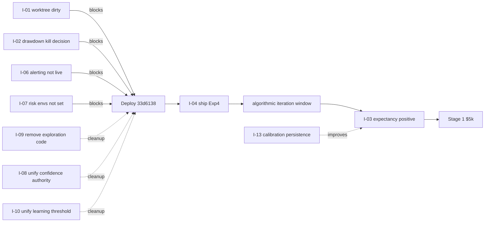

# Master Issue Ledger

**Date**: 2026-04-23 | **Live**: `ce06d41` | **HEAD**: `33d6138`

Strict triage table. Each row: ID, priority (P0–P3), category, title, evidence (file:line or commit/diff), impact, action.

Categories: `structural`, `mechanical`, `architecture`, `ops`, `algorithm`, `risk`, `testing`, `edge`.

---

## P0 — blockers (resolve before any deploy OR real-money consideration)

| ID | P | Cat | Title | Evidence | Impact | Action |
|---|---|---|---|---|---|---|
| **I-01** | P0 | mechanical | **Worktree dirty — 4 backward reverts** | `git diff HEAD` on `adaptive_exits.py`, `pyramider.py`, `scripts/generate_experiment_observation_report.py`, `monitoring/memory_monitoring.json`; all md5-match `ce06d41` | Any rebuild from worktree ships ambiguous code between live and HEAD. Blocks deploy. | `git restore` all 4 files (revert to HEAD) OR commit reverts with explicit rationale. Do this before any other action. |
| **I-02** | P0 | risk | **Drawdown kill 4× more permissive at runtime than code default** | `governance.py` default 0.05; `.env` → container 0.20; `resolved_config_snapshot.json` | Code reader/reviewer expects −5% auto-halt; actual −20%. Inflated real-money risk. | Decide canonical (recommend 0.05 for Stage-1 $5k, 0.10 for Stage-2). Add startup validator that WARNs if env/default ratio > 1.5× on any risk parameter. |
| **I-03** | P0 | edge | **Negative expectancy lifetime (−$1.92/trade)** | `TRADING_EDGE_BASELINE_REPORT.md`; `PLATFORM_STATE_SNAPSHOT_APR23.md §15`; brain `cumulative_pnl=−619.75` on 370 trades | Blocks Stage-1 real-money entry. Cannot close by mechanical fixes — requires algorithmic iteration. | Ship Exp4 + tighten chop pyramid_cut threshold + 60-min opening block; run 5–10 more sessions; target +$0.50/trade sustained 3 weeks. |

---

## P1 — urgent correctness / safety

| ID | P | Cat | Title | Evidence | Impact | Action |
|---|---|---|---|---|---|---|
| **I-04** | P1 | mechanical | **Exp4 (chop-trail widen) reverted in worktree; edge leak persists** | `adaptive_exits.py` diff; `PLATFORM_STATE_SNAPSHOT_APR23.md §15` notes $195 of MFE giveback in 5 sessions | $195 of giveback over 5 sessions is the largest single non-pyramid-cut leak | Un-revert + deploy with hardening bundle. Monitor chop trailing-stop trades for giveback reduction over 5 sessions post-deploy. |
| **I-05** | P1 | mechanical | **G3 pyramider NaN guard reverted in worktree** | `pyramider.py` diff — 8-line guard removed | Silent pyramid disable if streaming provider injects NaN. Low probability, high pain. | Decide keep/remove; recommend KEEP. Restore to HEAD or commit intentionally. |
| **I-06** | P1 | ops | **Alerting wired at HEAD, NOT in live container** | Commit `33d6138` adds `send_alert()` in 3 modules; live at `ce06d41` pre-dates | Critical events (save-guard fire, feature drift, pre-open fail) ship silent | Deploy hardening bundle + set `SLACK_WEBHOOK_URL`. Test via staged critical trigger. |
| **I-07** | P1 | risk | **Daily max-loss + per-trade notional env-gated default-off** | Commit `bb5cbb5`; defaults 0 = disabled | Deploying `33d6138` without envs = circuit breakers inert. | Set `ORGANISM_MAX_DAILY_LOSS=500`, `ORGANISM_MAX_NOTIONAL=2500` in `.env` before deploy. |
| **I-08** | P1 | architecture | **Confidence authority split 3 ways** | `ml_signal.py:486`, `alpha_scanner.py:157`, `kelly_sizer.py:110`, `live_engine.py:2170–2184` | Semantic drift between readers; calibration staleness in one doesn't propagate to others | Single authority in `ml_signal._compute_effective_confidence`. Other modules read from signal_gen, not maintain own thresholds. |
| **I-09** | P1 | structural | **Exploration half-removed — flag + routing dead code** | `live_engine.py:186` flag read; 2241–2261 `_route_exploration`; 2624 comment "REMOVED" | Misleading for maintainers; flag re-enable would no-op | Delete flag global + routing block + `_exploration_rejects` list. Update improve9 note. |
| **I-10** | P1 | algorithm | **Learning-mode threshold declared in two modules** | `kelly_sizer.py:198` vs `alpha_scanner.py` | Desync risk between sizer and scanner on learning vs production | Extract to `governance.py` / `OrganismConfig`. Single truth. |
| **I-11** | P1 | ops | **Fitness gate split — telemetry static vs live dynamic** | `decision_telemetry.py:45` static 0.45; `live_engine.py:2916` computed 0.45/0.0 | Operator logs say gate=0.45; actual runtime used 0.0 in learning. Hides reject reason. | Pass computed gate to telemetry; remove static default. |
| **I-12** | P1 | risk | **Image built from `ce06d41` when tree was at a different commit** | Image `sha256:32296c...`, built 2026-04-16T02:42Z from worktree at `ce06d41`. File-hash fingerprint 5/5 match at `ce06d41`. | Deploy process doesn't enforce "build from HEAD". Reproducibility risk. | Add `git rev-parse HEAD` assertion to image build step; write commit SHA into container as `/app/VERSION`; expose via `GET /health`. |

---

## P2 — correctness drift / hidden behavior

| ID | P | Cat | Title | Evidence | Impact | Action |
|---|---|---|---|---|---|---|
| **I-13** | P2 | algorithm | **Calibration map reset on every retrain** | `ml_signal.py:202` instance field, not persisted | One-epoch uncalibrated window; `effective_confidence` falls back to raw (overstated) | Persist to brain; on retrain, blend old/new. |
| **I-14** | P2 | algorithm | **Ensemble `predict_proba` silently returns 0.5 on exception** | `ensemble_models.py:281` bare except | Broken model produces neutral signal without alert | `logger.error` + mark model unhealthy or raise. |
| **I-15** | P2 | algorithm | **Regime PSI returns 0.0 on exception** | `regime.py:606–609` bare except | Silent non-detection of regime instability | `logger.warning` with histogram context. |
| **I-16** | P2 | ops | **Governance state transitions have no audit log** | `governance.py:102–116` | If frozen in production, no record of who/why | `logger.critical` with before/after/caller. |
| **I-17** | P2 | structural | **Kelly drawdown floor can invert cutoff** | `kelly_sizer.py:550–561` no validation | Pathological constructor → increased size at max drawdown | `__post_init__` assertion. |
| **I-18** | P2 | structural | **4 regime tables with no sync guarantee** | `adaptive_exits.py:130–181` | New regime label silently falls back to defaults | Single `RegimeConfig` dataclass; validate at init. |
| **I-19** | P2 | structural | **Evolved-params application lacks version tag** | `live_engine.py:2665–2668` | Stale base scaling persists across freeze/unfreeze | Add `params_generation` to evolved_params. |
| **I-20** | P2 | algorithm | **Config split across 4 sources (no authority)** | `DEAD_CODE_AND_BYPASS_AUDIT.md` D-01 to D-16 | Drift over releases; hard to audit runtime | `docs/engineering/config_manifest.md` + startup diff-vs-default validator. |
| **I-21** | P2 | testing | **4 flaky async tests (pass individually, fail in full suite)** | `CLAUDE.md` gotcha | Full test-suite runs unreliable | Triage top flakes; serialize problematic tests. |
| **I-22** | P2 | ops | **Container predates alerting commit** | Image date 2026-04-16; alerting at `33d6138` 2026-04-19 | Any restart of current image brings back silent criticals | Rebuild at HEAD when deploying hardening bundle. |

---

## P3 — technical debt

| ID | P | Cat | Title | Evidence | Action |
|---|---|---|---|---|---|
| **I-23** | P3 | structural | **Background trainer force-reset mutates private state** | `live_engine.py:2655–2656` | Add `reset()` method; call public API |
| **I-24** | P3 | structural | **Universe selector protects open-position symbols only** | `universe_selector.py:91` | Clarify contract or rename |
| **I-25** | P3 | ops | **`/organism/train` returns untyped dict** | `routes.py:190–195` | Typed `TrainResponse` |
| **I-26** | P3 | ops | **Observation tooling for exploration promised, not delivered** | `live_engine.py:2261–2266` comment | Delete comment or implement |
| **I-27** | P3 | structural | **`_exploration_rejects` tracked, never acted on** | `kelly_sizer.py:134–135` | Remove or wire spike alert |
| **I-28** | P3 | docs | **90+ untracked `*_REPORT.md` at repo root** | `git status` | Move to `docs/engineering/reviews/` |
| **I-29** | P3 | structural | **`ORGANISM_EXPLORATION_ENABLED` env read, never consumed** | `live_engine.py:186` | Delete (part of I-09) |
| **I-30** | P3 | algorithm | **`_ML_CONFIDENCE_MIN` hardcoded in kelly_sizer** | `kelly_sizer.py:110` | Env override OR move to `OrganismConfig` |

---

## Issue dependency graph

---

## Count by priority

| Priority | Count |
|---|---|
| P0 | 3 |
| P1 | 9 |
| P2 | 10 |
| P3 | 8 |
| **Total** | **30** |

## Count by category

| Category | P0 | P1 | P2 | P3 | Total |
|---|---|---|---|---|---|
| mechanical | 1 | 2 | — | — | 3 |
| risk | 1 | 2 | — | — | 3 |
| edge | 1 | — | — | — | 1 |
| architecture | — | 1 | — | — | 1 |
| structural | — | 2 | 3 | 4 | 9 |
| algorithm | — | 1 | 4 | 1 | 6 |
| ops | — | 2 | 2 | 2 | 6 |
| testing | — | — | 1 | — | 1 |
| **total** | **3** | **10** | **10** | **7** | **30** |

— End of Master Issue Ledger —
