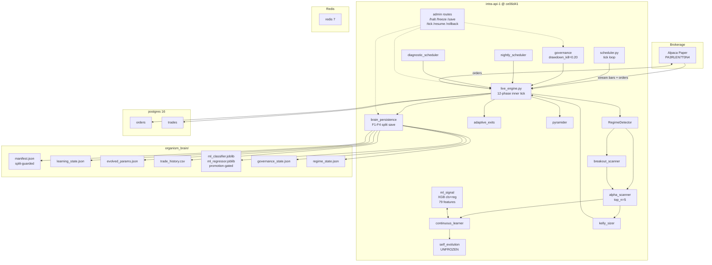
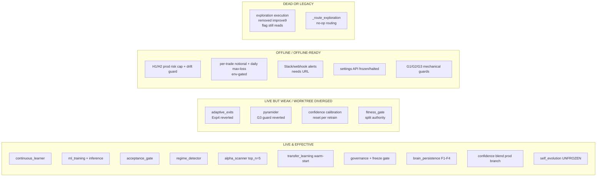
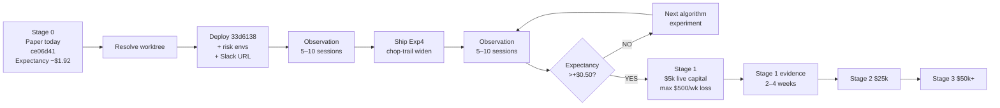

# MASTER PLATFORM STRATEGY SUMMIT

**Date**: 2026-04-23 (post-close, paper PAUSED)
**Mode**: Read-only strategic review. No code edits. No deploys. No restarts. No POSTs to live.
**Scope**: Whole platform — coherence, edge, real-money readiness.
**Bundle**: `master_platform_strategy_summit_bundle/`

---

## 0. EXECUTIVE SUMMARY (one page)

### Verdicts
| Dimension | Verdict |
|---|---|
| **Overall** | **READY IF SPECIFIC BLOCKERS ARE PATCHED** — mechanically ready, algorithmically not. |
| **Platform coherence** | **PARTIALLY COHERENT** — core loop, persistence, ML, governance are live and wired. Pockets of duplication, split config sources, reverted experiments, and one-tier-removed dead code. |
| **Organism truth** | **PARTIALLY FUNCTIONAL** — continuous learning / ML / evolution / regime / transfer all live. Evolution unfrozen (370 > 300). But the *algorithmic edge is negative* — entries fire 78% in the right direction, exits destroy the edge. |

### What the platform actually is, today
An asyncio FastAPI engine tick-driving a 12-phase loop against Alpaca paper: streaming bars → features → regime → breakout + alpha (ML) scanners → dual confidence blend (learning-mode 0.65/0.35/0 vs production 0.50/0.30/0.20) → unified entry gates (fitness, sector, liquidity, circuit-breaker, confidence) → Kelly sizing → submit → reconciliation → adaptive ATR exits + momentum pyramider → trade record → continuous learner → split-persistence brain save with manifest guard (F1–F4). A regime detector, transfer-learning warm-start, and self-evolution (unfrozen at 300 trades) adapt weights. Governance, drawdown kill, force-save, halt/freeze admin routes are present. Alerting is wired in HEAD but NOT in the live container.

### The one-sentence status
Live container is **`ce06d41`** (4 commits behind HEAD `33d6138`); brain is **gen 115, 370 trades, −$619.75, Sharpe 3.44**; equity **$111,529.48** (flat); expectancy **−$1.92/trade** lifetime, **−$0.41** last-100 (improving); working tree has **4 uncommitted reverts** pointing *backward* to match live; **DEPLOY 2 was hard-stopped** on 3 preflight blockers (dirty tree, missing `ORGANISM_MAX_NOTIONAL`/`MAX_DAILY_LOSS`, missing `SLACK_WEBHOOK_URL`).

### The three things that matter
1. **The edge problem is exits, not entries.** 78% of entries go green (MFE > 0). 76% of green trades close as losses. `pyramid_cut` is 100% loser class; `timeout`/`max_hold` is near 100% winner class. Exit system destroys entry edge. Exp1A (chop min-hold) and Exp2 (inverse-ETF chop suppression) target this; both live. Exp4 (chop-trail widen) was reverted and is NOT live. Exp3 is instrumentation-only.
2. **Live ≠ repo.** Live is `ce06d41`. HEAD is `33d6138`. The 4-commit delta contains G1/G2/G3 mechanical guards, H1/H2 production risk-budget cap + feature drift guard, H5 API governance enforcement, per-trade notional + daily max-loss circuit breaker (env-gated), and Slack/webhook alerting. None of this is in the running container. The uncommitted worktree edits revert Exp4 and G3 *backward* toward live — not forward. You cannot describe "what the platform does" without saying which commit you mean.
3. **Mechanical ceiling has been reached; the ceiling to lift now is algorithmic.** Persistence is hardened (Full Patch F). Reconciliation survives stale fills and broker sync collapse. Unified entry gates. Walk-forward gate active. Split persistence preserves runtime truth even when gate blocks. Governance/halt/force-save all work. What remains for real money is not a structural question — it's proving positive expectancy over 3 weeks, adding daily-loss auto-halt, wiring Slack, and staging a tiny-capital pilot.

### What to do next (24-hour window)
- **Resolve worktree**: either commit the reverts intentionally OR `git restore` to HEAD. Current limbo is a shipping blocker. See [Issue L-01](#l-01).
- **Decide on the hardening bundle**: deploy `33d6138` (bringing G1-G3, H1/H2 prod caps, H5 API, Slack) or stay on `ce06d41` through another observation window. See [Action A2](#ship-next).
- **Do not ship Exp3B (confidence inversion) yet** — 7-session pattern weakened on last observation; insufficient data.
- **Do not start real-money**. Expectancy still negative. No auto-halt on daily loss in live container.

---

## 1. ORIENTATION — what the platform IS today

### 1.1 System architecture (live)



### 1.2 End-to-end trade lifecycle

```mermaid
sequenceDiagram
  autonumber
  participant Sched as scheduler
  participant LE as live_engine
  participant Alp as Alpaca
  participant Reg as regime
  participant Scn as scanners
  participant ML as ml_signal
  participant Ks as kelly_sizer
  participant Gov as governance
  participant Ex as adaptive_exits
  participant Py as pyramider
  participant Rec as reconcile
  participant Cl as continuous_learner
  participant BP as brain_persistence

  Sched->>LE: tick()
  LE->>Gov: halt? warmup? EOD? stale_data?
  LE->>Alp: fetch bars
  LE->>Reg: detect(features)
  LE->>Scn: breakout_scanner + alpha_scanner(learning_mode?)
  Scn->>ML: predict_batch(features)
  ML-->>Scn: ml_signals (top_n=5)
  LE->>LE: _compute_confidence (learning=0.65B+0.35T; prod=0.50ML+0.30B+0.20T)
  LE->>LE: _passes_entry_gates (sector/fitness/liquidity/circuit/cooldown/pending)
  LE->>Ks: size(confidence, fitness, regime, equity)
  Ks-->>LE: shares (risk_budget=0.001 learn / 0.0025 prod)
  LE->>Alp: submit_entry
  Alp-->>LE: order state (stream)
  LE->>Rec: _reconcile_closes (stale-fill safe)
  Rec->>LE: TradeRecord (MFE/MAE/regime_at_entry/exit)
  LE->>Ex: check_exit (stop/trail/ftf/timeout/tp)
  LE->>Py: should_pyramid (momentum add or cut)
  LE->>Cl: record_trade / retrain
  Cl->>ML: train(features); acceptance_gate
  LE->>BP: save_essential_state (guarded manifest)
```

### 1.3 Organism feature map



---

## 2. PHASE 1 — LIVE vs BRANCH REALITY

| State | Commit / Component | Notes |
|---|---|---|
| **LIVE NOW** | `ce06d41` in `intra-api-1` (healthy, 21h uptime, 0 restarts) | Exp1A + Exp2 + Exp3-prep. Paper **operationally paused** post Apr-23 close, but runtime flags `frozen=false`, `trading_halted=false`. |
| **REPO HEAD** | `33d6138` on `main` | 4 commits ahead of container. |
| **WORKTREE EDITS** | 4 files, all `git diff` md5-match `ce06d41` | Backward reverts of Exp4 (`adaptive_exits.py`), G3 (`pyramider.py`), giveback tooling (`scripts/…`), monitoring threshold (`monitoring/…`). Not forward progress. |
| **FROZEN (disk)** | `ml_classifier.joblib`, `ml_regressor.joblib`, `evolved_params.json`, `reference_feats.csv` — all Apr-15 mtime | Image-era snapshots. In-memory learner has evolved to gen 115 (disk is stale by design until next save overwrites). |
| **FROZEN (runtime)** | Paper trading operationally PAUSED per user policy | NOT enforced at governance layer — any POST to `/api/v1/organism/*` would resume trading. |
| **NOT FROZEN** | `organism_brain/manifest.json`, `learning_state.json` (gen 115, 370 trades) | These are continuously saved by the running container. |

### 2.1 The 4-commit delta (`ce06d41` → `33d6138`) is NOT live

| Commit | Category | Summary |
|---|---|---|
| `15cc0a4` | Mechanical | **G1** exit-level restore warning + **G2** cooldown-on-success-only + **G3** NaN pyramid guard |
| `b97f903` | Experiment | **Exp4** chop trailing-stop giveback control (widen to 5× ATR or disable) |
| `679ffd2` | Risk | **H1** production risk-budget cap + **H2** feature drift guard |
| `bb5cbb5` | Risk | Per-trade notional cap + daily max-loss circuit breaker (env-gated; default inert) |
| `c306074` | Governance | **H5** settings API enforces frozen/halted state |
| `33d6138` | Alerting | Slack/webhook for critical events (needs `SLACK_WEBHOOK_URL`) |

### 2.2 Where branch/repo/live differ

- **Live container file hashes** fingerprint 5/5 critical files at `ce06d41`. Source tree is at `33d6138` with 4 backward reverts. If someone rebuilt the image today from the current worktree, they would ship something *between* `ce06d41` and HEAD that is hard to describe by any single commit. **This is a shipping hazard.**
- **Environment overrides defaults silently.** `ORGANISM_DRAWDOWN_KILL_PCT=0.20` in container ≠ `0.05` in `governance.py` default. 4× more permissive at runtime than code implies. See [I-03](#i-03).

---

## 3. PHASE 2 — SUBSYSTEM MAP

Full map in **[PLATFORM_SYSTEM_MAP.md](PLATFORM_SYSTEM_MAP.md)**. Summary:

| # | Subsystem | Primary file(s) | Status | Notes |
|---|---|---|---|---|
| 1 | Live tick loop | `live_engine.py` (4990 L) | **LIVE** | 12 ordered phases; `_live_tick_inner` |
| 2 | Persistence | `brain_persistence.py` (1869 L) | **LIVE** | F1–F4 manifest guard; split save; break-glass logged |
| 3 | Continuous learner | `continuous_learner.py` | **LIVE EFFECTIVE** | observe_trade + retrain on schedule |
| 4 | ML training + inference | `ml_signal.py`, `ml_features.py`, `background_trainer.py` | **LIVE EFFECTIVE** | 79 features, gen 115, XGB, acc 61.7% |
| 5 | Acceptance gate | `continuous_learner.acceptance_gate()` | **LIVE EFFECTIVE** | composite score + calibration check, rollback on reject |
| 6 | Walk-forward gate | `walk_forward.py` | **LIVE** | Reads authoritative `learner.state.best_sharpe` |
| 7 | Confidence formula | `live_engine.py` 2170–2184 | **LIVE (PROD branch)** | 370 > 200 → production blend active |
| 8 | Regime detection | `regime.py` | **LIVE EFFECTIVE** | Consumed by exits, alpha, evolution, inverse-ETF gate |
| 9 | Alpha scanner | `alpha_scanner.py` | **LIVE EFFECTIVE** | top_n=5, learning_mode param zeros ML weight |
| 10 | Adaptive exits | `adaptive_exits.py` | **LIVE, DIVERGED WORKTREE** | HEAD has Exp4; worktree reverts Exp4; container runs pre-Exp4 |
| 11 | Pyramider | `pyramider.py` | **LIVE, DIVERGED WORKTREE** | HEAD has G3 NaN guard; worktree reverts it; container runs pre-G3 |
| 12 | Kelly/risk sizer | `kelly_sizer.py` | **LIVE** | `_ML_CONFIDENCE_MIN=0.5` hardcoded (P2) |
| 13 | Governance / drawdown | `governance.py`, `trading_phase.py` | **LIVE** | Container kill_pct=0.20 overrides code 0.05 |
| 14 | Self-evolution | `self_evolution.py` | **LIVE, UNFROZEN** | 370 ≥ 300 threshold; evolve() running |
| 15 | Transfer learning | `transfer_learning.py` | **LIVE** | Warm-start from regime-matched snapshots |
| 16 | Broker integration | `backend/integrations/alpaca_*` | **LIVE (paper)** | Stream client; terminal-state handling |
| 17 | Scheduler / background jobs | `scheduler.py`, `nightly_scheduler.py`, `diagnostic_scheduler.py`, `background_trainer.py` | **LIVE** | No overlap; admin-visible |
| 18 | Admin routes | `routes.py` (865 L) | **LIVE** | `/halt /freeze /save?force=true /rollback /tick` — all admin-auth |
| 19 | Monitoring / alerting | `backend.infra.alerting` | **PARTIAL** | Wired in `33d6138` commit, NOT in live container |
| 20 | Test suite | `tests/` (~447 files) | **LIVE, 4 FLAKY** | Core subsystems covered |

---

## 4. PHASE 3 — ORGANISM TRUTH

Detail in **[ORGANISM_FEATURE_STATUS.md](ORGANISM_FEATURE_STATUS.md)**. Summary:

| Feature | Classification | Matters now? | Action |
|---|---|---|---|
| continuous_learning | LIVE & EFFECTIVE | yes | keep |
| feature generation (79) | LIVE & EFFECTIVE | yes | keep |
| ML training (XGB cls+reg) | LIVE & EFFECTIVE | yes | keep |
| model acceptance / rejection | LIVE & EFFECTIVE | yes | keep |
| model use in confidence | LIVE (prod branch since trade 200) | yes | keep; **fix calibration loss on retrain** (P2) |
| self-evolution | LIVE, UNFROZEN at 370 trades | yes | keep; monitor for evolved_params drift |
| evolved_params application | LIVE but disk-stale (Apr 15) vs memory (gen 115) | yes | keep; expect rewrite on next save |
| transfer_knowledge | LIVE (warm-start) | low | keep |
| walk-forward gating | LIVE | yes | keep |
| regime adaptation (exits, size, entry) | LIVE | yes | keep |
| alpha ranking (top_n=5) | LIVE | yes | keep |
| pyramiding (momentum add + cut) | LIVE but NaN guard diverged | yes | **resolve G3 revert** (P1) |
| exit adaptation (ATR × regime) | LIVE, but **actively destroying edge** | yes | **algorithmic rework** (P0 edge) |
| scheduler / promotions | LIVE | yes | keep |
| **exploration** | **DEAD CODE** — execution removed (improve9) but flag read + routing logic remain | no | **remove** |

---

## 5. PHASE 4 — END-TO-END DECISION PATHS

Detail in **[DATAFLOW_AND_DECISION_PATHS.md](DATAFLOW_AND_DECISION_PATHS.md)**. Covers:

1. Normal winning trade (SPY, production-mode confidence 0.576)
2. Losing trade (XLE pyramid_cut −$6.65 at 5 bars)
3. Inverse ETF candidate (PSQ in chop — **Exp2 blocks**)
4. pyramid_cut / trailing_stop case
5. Force-save / persistence path (`POST /organism/save?force=true`)

Each path shows exact file:function chain, duplication warnings, and evaluation-order dependencies.

---

## 6. PHASE 5 — STRUCTURAL AUDIT

Detail in **[DEAD_CODE_AND_BYPASS_AUDIT.md](DEAD_CODE_AND_BYPASS_AUDIT.md)** and **[MASTER_ISSUE_LEDGER.md](MASTER_ISSUE_LEDGER.md)**.

Top 10 structural / mechanical issues:

| ID | Class | P | Title | Where |
|---|---|---|---|---|
| I-01 | mechanical | **P0** | Worktree dirty — 4 backward reverts block any deploy | git status |
| I-02 | risk | P0 | Drawdown kill 4× more permissive than code default (0.20 vs 0.05) | `governance.py`:58 vs `.env` |
| I-03 | algorithm | P0 | Negative expectancy (−$1.92 lifetime) — edge problem | trade_history.csv |
| I-04 | architecture | P1 | Confidence authority split 3 ways (ml_signal, alpha_scanner, kelly_sizer) | D04 |
| I-05 | architecture | P1 | Learning-mode threshold defined in two modules (alpha_scanner, kelly_sizer) | D19 |
| I-06 | structural | P1 | Exploration half-removed — flag + routing still exist, execution gone | `live_engine.py`:186, 2241–2261, 2624 |
| I-07 | mechanical | P1 | Pyramider NaN guard reverted in worktree (silent failure on stale streaming) | `pyramider.py` diff |
| I-08 | mechanical | P1 | Exp4 reverted in worktree; giveback leak persists in live | `adaptive_exits.py` diff |
| I-09 | ops | P1 | Alerting wired at HEAD (`33d6138`), NOT in live container — criticals ship silent | diagnostic_scheduler.py |
| I-10 | algorithm | P1 | Calibration map (effective_confidence) reset on every retrain | `ml_signal.py`:202 |

---

## 7. PHASE 6 — TRADING EDGE

### 7.1 Strategy stack reassessment

| Layer | State | Verdict |
|---|---|---|
| Entry signal | ML (0.50) + breakout (0.30) + tension (0.20) in prod; 65B+35T in learning | **DIRECTION IS RIGHT** — 78% of trades go green at some point. MFE reliably > 0. |
| Regime gating | chop/trend/vol detected; inverse-ETF chop suppression via Exp2 | Working; **chop is 96%+ of ticks** — the system lives in chop. |
| Confidence gate | 0.40 baseline / 0.45 defensive; 0.25 in learning | Apr-21 observation: ≥0.45 bucket outperformed for first time (pattern weakening). Need more data. |
| Sizing | Kelly with fitness scale, risk_budget 0.001 learning / 0.0025 prod | Sized small enough that single-trade tails are manageable. |
| **Exits** | ATR stops × regime; momentum pyramider with cuts; FTF; trailing; timeout | **THIS IS THE LEAK.** pyramid_cut = 100% losers. timeout = ~100% winners. Exits destroy entry edge. |
| Scanner breadth | 12/22 universe traded; chop breakouts dominated | Breadth adequate. Not the problem. |
| Opening range | 9:30–10:00 ET block | Adequate but the 10:00–11:00 window still 0% wr. |
| Post-300 | Evolution unfrozen; take_profit exit now available | Inconclusive (1 +$10.73, 1 −$8.56 session). |

### 7.2 Top 5 algorithmic leaks (by PnL impact)

1. **`pyramid_cut` in chop** — 24/32 trades in baseline, 100% losers, −$63.80. 6/16 trades on Apr-21 session, 100% losers, −$14.35. **Exp1A (min-hold gate) is live; reduced pyramid_cut share 56%→33%. Further widening in chop needed.**
2. **Trailing-stop giveback** — $195.21 of MFE destroyed over 5 sessions. **Exp4 targets this (chop trail widen to 5× ATR) but is reverted in worktree and NOT live.**
3. **Inverse ETF entries in chop** — PSQ/SH were 0% wr, −$28.54 in baseline. **Exp2 live; eliminated.** Keep.
4. **Opening-range faked breakouts (10:00–11:00 ET)** — 0% wr; not addressed. **Backlog experiment: extend block to 10:30 or 11:00 ET.**
5. **ML contamination in production blend** — for 6+ sessions, lower-confidence trades outperformed higher-confidence ones (inverse). Pattern weakened on Apr-21. **Exp3 is observation-only.** Do not ship Exp3B (invert the formula) on current evidence.

### 7.3 Top 5 current strengths

1. **Persistence + manifest guard (Full Patch F)** — 0 wipes, 0 save failures over 5+ sessions.
2. **Reconciliation hardening** — stale-fill prevention, regime_at_exit capture, pyramid-level preservation on broker sync collapse.
3. **Unified entry gates** — single `_passes_entry_gates()` path; two entry sources (breakout, alpha) converge at one gate.
4. **Acceptance gate** — composite-score + calibration-monotonicity check on every retrain; rollback on reject.
5. **Container stability** — 0 restarts, 21h uptime, healthy.

### 7.4 Is exits still the main problem?
**Yes, and now clearer.** The data is unambiguous: entries pick direction correctly ~78% of the time; exits realize losses on 76% of those. The entire lifetime cumulative PnL of −$619.75 is explained by premature exits, not bad direction.

### 7.5 Is confidence/ML the next core issue?
**Secondary.** Exp3 seven-session pattern weakened on Apr-21. Not enough data to invert. Focus remains on exits until expectancy turns.

### 7.6 Next 3 algorithm changes (recommended order)

1. **Ship Exp4 (chop-trail widen) + Exp1A-tighter** — these directly target the two largest leaks (pyramid_cut and trailing-stop giveback). Reverted Exp4 must be un-reverted first.
2. **Opening-range block 30 → 60 min** (9:30 → 10:30 ET). Very low risk, addresses 0%-wr window.
3. **Widen pyramid_cut adverse threshold in chop regime** from −1.0R/−1.8R to ≥ −2.5R. Alternate to / complement of Exp1A's min-hold.

---

## 8. PHASE 7 — REAL-MONEY READINESS

Full map in **[REAL_MONEY_GAP_MAP.md](REAL_MONEY_GAP_MAP.md)**. Summary:

| Dimension | Current | Target | Gap | Evidence to close |
|---|---|---|---|---|
| Structural (persistence, reconciliation, EOD) | ✅ CLOSED | same | 0 | 5-session 0-wipe window + Full Patch F |
| Edge (expectancy +) | −$1.92/trade | +$0.50 sustained 3 wk | **LARGE** | 3 consecutive positive weeks in paper |
| Win rate | 18.8% lifetime (34% recent) | >30% sustained | **LARGE** | 3-week window, not single days |
| Sharpe | Negative recent | >1.0 annualized | **LARGE** | Same |
| Daily max-loss auto-halt | None in live | −$500/day auto-halt | MEDIUM | Deploy `bb5cbb5` with `ORGANISM_MAX_DAILY_LOSS=500` |
| Weekly max-DD halt | None | −$1500/week | MEDIUM | Code change + env |
| Sector concentration cap | 3/sector max | ≤40% notional/sector | MEDIUM | Code change |
| Alerting | Not wired live | Slack on criticals | MEDIUM | Deploy `33d6138` + set `SLACK_WEBHOOK_URL` |
| Kill switch (manual halt) | ✅ `/halt` | same | 0 | Admin-auth verified |
| Kill switch (auto) | drawdown_kill_pct=0.20 | 0.05 or position-loss auto-close | MEDIUM | Env flip + code |
| Staged rollout ladder | Defined (Stage 0→3) | same | 0 | See roadmap |

**Bottom line**: *Mechanically ready. Algorithmically not.* Earliest real-money eligibility is **4–8 weeks** of positive paper edge from today (2026-04-23).

---

## 9. PHASE 8 — MASTER ACTION MATRIX

Full detail in **[MASTER_ACTION_MATRIX.md](MASTER_ACTION_MATRIX.md)**. Summary:

| Bucket | Items |
|---|---|
| **A. LEAVE LIVE NOW** | Exp1A (chop min-hold), Exp2 (inverse-ETF chop suppression), Exp3-prep instrumentation, F1–F4 persistence, universe of 22, ALPHA_TOP_N=5, MAX_OPEN_POSITIONS=8, unified entry gates, confidence prod blend |
| **B. SHIP NEXT** (after worktree resolved) | Hardening bundle = `33d6138` (G1/G2/G3 mechanical guards, H1/H2 prod risk-budget cap + drift guard, H5 API enforcement, per-trade notional + daily max-loss env-gated, Slack wiring) |
| **C. PREPARE OFFLINE** | Exp4 (un-revert, chop trail widen), opening-range block 30→60 min, widen chop pyramid_cut adverse threshold, calibration persistence across retrains, config manifest + startup validation |
| **D. FIX BEFORE REAL MONEY** | Worktree resolution (I-01), drawdown-kill pct sanity (I-02), daily max-loss auto-halt LIVE (not env-inert), Slack LIVE with URL, remove exploration dead code, unify confidence authority (ml_signal → kelly + alpha), sector concentration cap, alerting dashboard, 3-week positive expectancy |
| **E. BACKLOG / REMOVE / SIMPLIFY** | Exp3B (confidence inversion) — on hold pending more Exp3 data, dead route `_route_exploration`, `ORGANISM_EXPLORATION_ENABLED` flag read, direct `_bg_trainer._is_training` mutation, unify regime tables to single RegimeConfig, decision_telemetry static fitness_gate |

---

## 10. PHASE 9 — ROADMAP TO STAGE 1

Full detail in **[MASTER_ROADMAP_FROM_NOW_TO_STAGE1.md](MASTER_ROADMAP_FROM_NOW_TO_STAGE1.md)**.



| Stage | Entry criteria | Exit criteria (advance) | Blockers |
|---|---|---|---|
| **0 — Paper (CURRENT)** | — | ≥3 wk positive expectancy, wr >30%, max DD <3% equity | Expectancy negative; worktree dirty; hardening bundle not deployed |
| **1 — Tiny live $5k** | Stage 0 criteria met + daily-loss auto-halt LIVE + Slack LIVE + no open P0s | 2–4 wk positive real-money perf | Stage 0 edge not yet established |
| **2 — Controlled $25k** | Stage 1 metrics hold with real fills | Sharpe >1.0, intraday DD <2% | Risk controls proven |
| **3 — Production $50k+** | Stage 2 metrics + sector caps + full alerting + change-control record | — | None |

---

## 11. PLAIN-ENGLISH NARRATIVE (founder / operator view)

> **The platform is real.** It runs 24/7 in a Docker container on paper-mode Alpaca. It sees 22 symbols, trades 12 of them, and has processed 370 trades over the last ~4 weeks. It persists its state reliably — we fixed a whole class of "trained brain overwritten by fresh state" bugs with the Full Patch F work, and the container has gone 21 hours without a restart or save failure. If you asked "will the platform still be running tomorrow morning?", the answer is yes.
>
> **The platform is learning.** A continuous learner ingests every trade, an XGBoost classifier+regressor retrains on 79 features on a schedule, an acceptance gate rejects bad retrains, and a self-evolution engine adjusts signal weights, exit parameters, and regime-size scales every epoch once 300 lifetime trades have been collected. That threshold was crossed. Transfer-learning warm-starts the evolved parameters from historical runs on restart. None of this is theatre — the generation counter is at 115, ML reports 61.7% directional accuracy, and the brain state matches the in-memory learner state.
>
> **The platform does not yet make money.** It has a **negative expectancy of −$1.92 per trade** over its lifetime. Curiously, the entries are good: 78% of trades go green at some point, which means the system is picking direction correctly most of the time. The exits are what destroy the edge — specifically, a mechanism called `pyramid_cut` that was designed to cut losing legs early but in practice closes trades on temporary adverse excursions that would have recovered. 100% of pyramid_cuts are losers. 100% of trades that run to timeout are winners. We're cutting the winners and force-holding until the losers hit hard stops.
>
> **Two experiments are helping and live.** "Exp1A" added a minimum-hold gate before pyramid_cut can fire in chop regime — that reduced the pyramid_cut share from 56% to 33% of trades. "Exp2" blocks entering inverse ETFs (PSQ, SH) during chop — those were 0% win rate and are now not traded. A third experiment, "Exp3", is only collecting data right now.
>
> **One experiment that could help most is not live.** "Exp4" widens the trailing-stop distance in chop from 3× ATR to 5× ATR, targeting the $195 of unrealized profit we've been leaving on the table over the last five sessions. That commit exists on disk but is reverted in the working tree and not in the running container.
>
> **We are at a mechanical ceiling.** Persistence, reconciliation, the admin surface, the scheduler, the acceptance gate, warmup, EOD flatten, stale-data gates, unified entry gates, circuit breakers, per-symbol fitness gates, the walk-forward gate — everything structural either works or is a short deploy away. What's missing from real-money readiness is: **positive expectancy**, **daily-loss auto-halt** actually running in the container (the code exists at HEAD), **Slack alerts** actually wired (ditto), and a **3-week track record** of positive paper performance.
>
> **The right next step is not a rewrite.** It is: resolve the worktree (commit or revert), deploy the hardening bundle (`33d6138`) with the risk caps enabled and Slack URL set, ship Exp4, run five to ten more paper sessions, and see if expectancy turns. If it does, we have a clear path to a $5k pilot. If it doesn't, we know which knob to turn next because the observation tooling tells us which exit type is leaking.
>
> **Do not deploy right now.** The worktree is dirty in a way that mixes forward progress with backward reverts. Do not start real-money right now. The edge hasn't turned. These are both solvable, in that order, over a measurable number of weeks.

---

## 12. STRICT ISSUE LEDGER (top view)

Full ledger in **[MASTER_ISSUE_LEDGER.md](MASTER_ISSUE_LEDGER.md)**. Top 10 active:

| ID | P | Class | Title | Action |
|---|---|---|---|---|
| I-01 | P0 | mechanical | Worktree dirty — 4 backward reverts | Commit or `git restore` |
| I-02 | P0 | risk | Drawdown kill 0.20 in container vs 0.05 code default | Decide canonical + startup warn |
| I-03 | P0 | edge | Negative lifetime expectancy (−$1.92/trade) | Ship Exp4; more iteration |
| I-04 | P1 | mechanical | Exp4 (chop-trail widen) reverted; leak persists | Un-revert; deploy with HEAD |
| I-05 | P1 | mechanical | G3 pyramider NaN guard reverted | Decide keep/remove; commit |
| I-06 | P1 | ops | Alerting wired at HEAD, not in live | Deploy `33d6138` + `SLACK_WEBHOOK_URL` |
| I-07 | P1 | risk | Daily max-loss + per-trade cap env-gated default-off | Deploy + set envs |
| I-08 | P1 | architecture | Confidence authority split 3 ways | Centralize in `ml_signal` |
| I-09 | P1 | structural | Exploration dead code still routes (execution removed) | Remove flag + `_route_exploration` |
| I-10 | P2 | algorithm | Calibration map reset on every retrain | Persist; blend old/new |

---

## 13. STRICT DEPLOYMENT / ACTION MATRIX (operator view)

Full matrix in **[MASTER_ACTION_MATRIX.md](MASTER_ACTION_MATRIX.md)**.

```mermaid
sequenceDiagram
  autonumber
  participant Op as operator
  participant Git as worktree
  participant Env as .env
  participant Img as image
  participant Ctr as container
  participant Alp as Alpaca
  participant Alg as algorithm

  Op->>Git: 1. Resolve dirty tree<br/>(commit or restore)
  Op->>Env: 2. Set ORGANISM_MAX_NOTIONAL, MAX_DAILY_LOSS, SLACK_WEBHOOK_URL
  Op->>Img: 3. Rebuild image at 33d6138
  Op->>Ctr: 4. docker compose up -d (zero-downtime-ish)
  Op->>Ctr: 5. Verify fingerprint matches 33d6138
  Op->>Alp: 6. Pre-open diagnostic
  Op->>Alg: 7. Resume trading; 5-10 session obs window
  Op->>Op: 8. Decide Exp4 un-revert & deploy
  Op->>Op: 9. Expectancy > +$0.50 for 3 wk? → Stage 1
```

---

## 14. FINAL VERDICTS

| Question | Verdict |
|---|---|
| Overall | **READY IF SPECIFIC BLOCKERS ARE PATCHED** (I-01, I-02 immediately; edge in 4–8 weeks) |
| Platform coherence | **PARTIALLY COHERENT** |
| Organism truth | **PARTIALLY FUNCTIONAL** (learning yes; edge no) |

### Top 15 findings

1. **Live ≠ repo ≠ worktree.** Container is `ce06d41`. HEAD is `33d6138`. Worktree reverts Exp4 and G3 backward toward live. No single commit describes "what's running".
2. **Mechanical hardening is real and complete.** Full Patch F + Waves A-C + Incident-Recovery XA/XB + unified gates + walk-forward split persistence is deployed and working.
3. **Continuous learning is genuinely running.** gen 115, 370 trades, ML retrained, acceptance gate active, evolution unfrozen.
4. **Negative expectancy is the dominant blocker.** −$1.92/trade lifetime. Mechanical fixes cannot close this.
5. **Exits destroy 91% of entry edge.** 25/32 trades go green; 19/25 close as losses; $33 of MFE forfeited; pyramid_cut is 100% losers.
6. **Inverse-ETF-in-chop bug is FIXED and live.** Exp2 eliminated 0%-win-rate PSQ/SH trades.
7. **Chop min-hold gate is FIXED and live.** Exp1A cut pyramid_cut share from 56% to 33%.
8. **The single highest-EV not-live change is Exp4** (chop-trail widen to 5× ATR). $195 of giveback over 5 sessions targets exactly this leak.
9. **Daily max-loss + per-trade notional cap exist in code but are env-gated default-off.** Not a safety net until `ORGANISM_MAX_DAILY_LOSS>0` and `ORGANISM_MAX_NOTIONAL>0` are set.
10. **Slack/webhook alerting is wired at HEAD but not in live.** Any "critical" ships silent in `ce06d41`.
11. **Drawdown kill is 4× more permissive at runtime than in code default.** Container env sets 0.20; code expects 0.05.
12. **Confidence authority is fragmented.** `ml_signal`, `alpha_scanner`, `kelly_sizer` all hold pieces of the blend.
13. **Learning-mode threshold is declared in two modules independently.** alpha_scanner and kelly_sizer could desync.
14. **Exploration is half-removed.** Execution gone (improve9). Flag read + `_route_exploration` routing remain — misleading dead code.
15. **ML calibration map is reset on every retrain.** Effective_confidence becomes uncalibrated for one epoch after each model swap.

### Top 10 active issues
See [§12](#12-strict-issue-ledger-top-view). I-01 through I-10.

### What is LIVE NOW
- Container `intra-api-1` @ `ce06d41`; redis + postgres healthy
- Exp1A, Exp2, Exp3-prep
- F1–F4 persistence, reconciliation hardening, unified gates, walk-forward gate
- Universe 22; `ALPHA_TOP_N=5`; `MAX_OPEN_POSITIONS=8`
- `ORGANISM_EXPLORATION_ENABLED=false`; `ORGANISM_LONG_ONLY=true`
- Production-mode confidence blend (trade 370 ≥ 200)
- Self-evolution unfrozen (370 ≥ 300)

### What is FROZEN NOW
- Paper trading operationally paused post-close per user policy (not at governance layer)
- On-disk ML joblib + evolved_params (Apr-15 mtime; in-memory state is fresher)

### What should SHIP NEXT
- **Hardening bundle `33d6138`** AFTER:
  1. resolve worktree (commit reverts intentionally OR `git restore`)
  2. set `ORGANISM_MAX_NOTIONAL`, `ORGANISM_MAX_DAILY_LOSS`, `SLACK_WEBHOOK_URL` in `.env`
  3. rebuild image
- THEN, after 5–10 paper sessions on the hardened stack: **un-revert and deploy Exp4** (chop-trail widen) as the first edge-moving change

### What should explicitly NOT SHIP next
- **Exp3B (confidence inversion)** — 7-session pattern weakened on Apr-21; insufficient evidence.
- **Any real-money switch** — edge is negative; no auto-halt on daily loss in live container.
- **Any partial subset** of `33d6138` — deploy the full bundle together or nothing; the commits depend on each other for risk semantics.

### What MUST BE FIXED BEFORE REAL MONEY
1. **I-01**: worktree clean
2. **I-02**: drawdown_kill_pct canonical decision + startup validation
3. **I-03**: +expectancy sustained ≥3 weeks in paper
4. **I-06**: Slack wired with URL and tested on staged critical event
5. **I-07**: daily max-loss auto-halt LIVE (not env-inert)
6. **I-09**: exploration dead code removed (no stale flag)
7. **I-10**: calibration persistence across retrains
8. **I-08**: confidence authority centralized
9. **Position-loss auto-close** (−$200/pos) and **sector concentration cap** (≤40%)
10. **Pre-flight + post-flight smoke-test runbook** (already drafted across multiple reports; needs consolidation into one canonical checklist)

### Paths to all reports

```
/Users/marselkei/VS/intra/MASTER_PLATFORM_STRATEGY_SUMMIT.md          ← this file
/Users/marselkei/VS/intra/master_platform_strategy_summit_bundle/     ← bundle dir
/Users/marselkei/VS/intra/PLATFORM_SYSTEM_MAP.md
/Users/marselkei/VS/intra/ORGANISM_FEATURE_STATUS.md
/Users/marselkei/VS/intra/DATAFLOW_AND_DECISION_PATHS.md
/Users/marselkei/VS/intra/DEAD_CODE_AND_BYPASS_AUDIT.md
/Users/marselkei/VS/intra/MASTER_ISSUE_LEDGER.md
/Users/marselkei/VS/intra/MASTER_ACTION_MATRIX.md
/Users/marselkei/VS/intra/REAL_MONEY_GAP_MAP.md
/Users/marselkei/VS/intra/MASTER_ROADMAP_FROM_NOW_TO_STAGE1.md
```

— End of Master Platform Strategy Summit —
