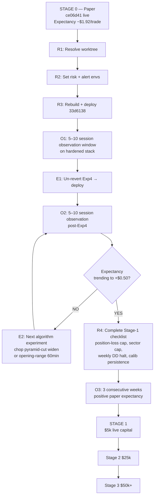
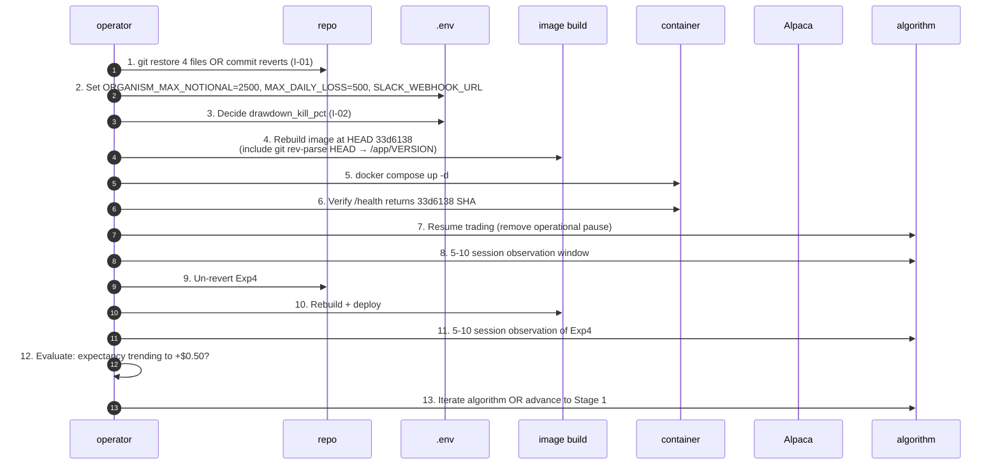

# Master Roadmap — Now → Stage 1 Tiny Live Capital

**Date**: 2026-04-23 | **Live**: `ce06d41` | **HEAD**: `33d6138`
**Goal**: Ship a tiny live-capital pilot ($5,000) once both mechanical and algorithmic readiness criteria are met.

---

## The roadmap in one picture

---

## Stage 0 — Paper (CURRENT)

### Current state
- Container `intra-api-1` @ `ce06d41`, healthy, 21h uptime
- Brain: gen 115, 370 trades, PnL −$619.75, best_sharpe 3.44, ML trained
- Equity: $111,529.48; flat; operationally paused
- Exp1A + Exp2 live; Exp3-prep instrumentation live
- Worktree dirty; HEAD 4 commits ahead

### Entry criteria
(already met) — Exp1A + Exp2 live on Full Patch F

### Exit criteria (= advance to Stage 1)
All must be TRUE:
1. Lifetime expectancy ≥ +$0.50/trade sustained ≥ 3 weeks
2. Win rate > 30% sustained over 3 weeks
3. Max intraday drawdown < 3% equity across 3 weeks
4. **All P0 ledger items resolved (I-01, I-02, I-03)**
5. **All P1 deploy-gating items resolved (I-04, I-06, I-07, I-12)**
6. Stage-1 checklist (below) fully green

### Blockers
- I-01 worktree dirty
- I-02 drawdown-kill decision
- I-03 negative expectancy
- I-04 Exp4 reverted
- I-06 alerting not live
- I-07 risk caps env-gated default-off

### Evidence required
- 5+ consecutive daily post-close reports showing improving expectancy
- Manifest + trade_history.csv consistency across save cycles
- Alerting receipt (test Slack message)
- Rollback drill (force-save → restart → fingerprint verify)

### Likely deployment sequence (within Stage 0)

---

## Stage 1 — Tiny live capital ($5,000)

### Entry criteria (= Stage 0 exit criteria PLUS)
- **`ORGANISM_MAX_DAILY_LOSS=500`** LIVE and tested
- **`ORGANISM_MAX_NOTIONAL=2500`** LIVE
- **`SLACK_WEBHOOK_URL`** LIVE and tested
- **`drawdown_kill_pct=0.05`** (tight for pilot)
- **Position-loss auto-close** at −$200/pos LIVE
- Governance state-transition audit log LIVE
- Image carries HEAD SHA; `/health` exposes it
- Worktree clean at HEAD
- Exploration dead code removed (I-09)
- Confidence authority centralized (I-08)
- Calibration persistence (I-13)
- 4 flaky async tests resolved (I-21)
- Pre-flight + post-flight runbook consolidated into a single canonical doc
- Rollback drill executed and logged
- Stage-0 exit criteria met (3 wk +expectancy, wr>30%, DD<3%)

### Risk budget
- Max $500/week loss (10% of capital)
- Per-trade cap $2,500 notional
- Daily max loss $500 auto-halt
- Drawdown kill at 5% equity

### Duration
- 2–4 weeks

### Exit criteria (= advance to Stage 2)
- Expectancy metrics hold with real fills and slippage (allow 10–20% degradation from paper)
- No incidents (save failures, reconcile bugs, order-state desync)
- No manual interventions except scheduled ops

### Blockers
- Anything on the Stage-1 checklist above that's not green

### Evidence required
- Daily equity curve (real Alpaca account)
- Fill-quality report (slippage vs model price)
- Alert receipts on any non-green day
- Reconciliation report per session

### Likely deployment sequence
- Migrate Alpaca account from paper to live (keyed)
- Seed account with $5,000
- Start trading day after weekend
- Post-close report every day
- Weekly review: decide continue / pause / roll back

---

## Stage 2 — Controlled scale-up ($25,000)

### Entry criteria (= Stage 1 exit PLUS)
- 2+ weeks of positive Stage-1 performance
- Sector-notional cap ≤ 40% LIVE
- Weekly max-drawdown halt LIVE (−$1,500/week)
- Ops dashboard scaffolded (live view: equity, positions, last-trade, gate state)
- On-call rotation defined

### Risk budget
- Max $2,500/week loss
- Per-trade cap scales to $5,000 notional
- Drawdown kill at 5% equity (unchanged)

### Duration
- 4–8 weeks

### Exit criteria (= advance to Stage 3)
- Sharpe >1.0 annualized
- Max intraday drawdown <2% equity
- Zero unrecoverable incidents
- ≥10 consecutive green trading sessions

---

## Stage 3 — Production candidate ($50,000+)

### Entry criteria
- All Stage-2 criteria met
- Full alerting stack + dashboard
- Ops runbook signed off by operator
- Change-control record complete

### This is the production bar
If Stage 3 sustained, platform is considered production-grade and additional capital decisions are business, not engineering.

---

## Week-by-week plan (first 6 weeks)

| Week | Dates | Goal | Deliverable |
|---|---|---|---|
| 1 | 2026-04-24 → 04-30 | Resolve worktree + deploy `33d6138` + 5 sessions observation | Clean git; image with SHA; post-deploy verification; 5 daily reports |
| 2 | 2026-05-01 → 05-07 | Un-revert Exp4 + deploy; 5 more sessions | Exp4 post-close report day 3 / day 5 |
| 3 | 2026-05-08 → 05-14 | Evaluate Exp4; decide next iteration | Decision doc: Exp4 verdict + next experiment |
| 4 | 2026-05-15 → 05-21 | Ship next edge experiment (chop pyramid-cut widen OR opening-range 60min) | Daily reports |
| 5 | 2026-05-22 → 05-28 | Stability + Stage-1 checklist close-out | Runbook doc; rollback drill log |
| 6 | 2026-05-29 → 06-04 | Decision point: Stage 1 go / no-go | Stage-1 readiness memo |

If all goes smoothly and expectancy turns positive fast, Stage 1 could start ~Jun 03 2026. If it takes longer, Stage 0 extends and real money waits.

---

## What to do if it doesn't work

If after 6 weeks Stage-0 exit criteria are NOT met:
1. Pause experimentation; freeze adaptation (`POST /organism/freeze`).
2. Deep replay-based analysis of last 200 trades.
3. Consider Phase C changes (separate ranking_score / direction / expected_return / size; microstructure alpha; staged learning→production) from `CLAUDE.md`.
4. Revisit ML contamination hypothesis with a larger observation window (12+ sessions).
5. Consider de-chopping: re-baseline in only high-vol / trending days (the 4% of ticks that aren't chop).

If after 12 weeks Stage-0 exit criteria still NOT met, escalate for architectural rethink — the current strategy stack may not be edge-capable in chop-dominated conditions, and alternative signal sources may be needed.

---

## Exit ramps (at any stage)

| Trigger | Response |
|---|---|
| 2-day consecutive loss > 5% equity | Halt trading, review |
| Save failure + guard fire | Force-save recovery drill, review |
| Reconciliation bug produces phantom position | Halt, review `reconcile_closes` |
| Alert silence > 24h (Slack offline) | Investigate alerting path before continuing |
| Fill quality degrades (slippage >20%) | Switch to paper; investigate |

---

## One-line summary

> Ship hardening `33d6138` with risk caps + Slack, un-revert Exp4, run 5–10 sessions, iterate to positive expectancy over 3 weeks, then stage-1 with $5k. The mechanical work is small. The algorithmic work is the real path.

— End of Master Roadmap —
