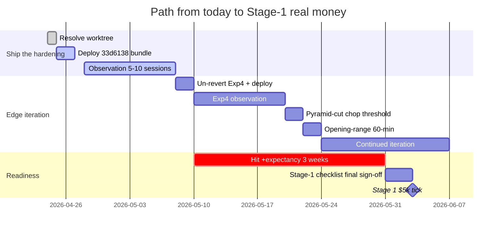

# Real-Money Gap Map

**Date**: 2026-04-23 | **Live**: `ce06d41` | **HEAD**: `33d6138`
**Current stage**: Stage 0 (paper only)
**Verdict**: **NOT READY for real money.** Earliest realistic timeline: 4–8 weeks from now.

---

## Gap analysis by category

### 1. Structural / mechanical readiness — MOSTLY CLOSED

| Item | Current | Target | Gap | Evidence to close |
|---|---|---|---|---|
| Brain persistence | Full Patch F + F-lite deployed; 5-session 0-wipe window | Same | ✅ CLOSED | `PLATFORM_STATE_SNAPSHOT_APR23` §14 |
| Force-save recovery | `/organism/save?force=true` admin-auth; suspicious-write logged | Same | ✅ CLOSED | Route + F3 read-back invariant |
| Manifest guard | `_write_manifest_guarded()` single path | Same | ✅ CLOSED | F1/F2 commits |
| Reconciliation | Stale-fill prevention + cost-weighted avg + broker-sync preservation | Same | ✅ CLOSED | `53cc1ad`, `d46e17a`, `2018999` |
| Container stability | 0 restarts, 21h uptime, healthy | Same | ✅ CLOSED | `docker ps`, 5-session observation |
| EOD flatten | 15:58 ET force flatten, verified every session | Same | ✅ CLOSED | Post-close reports |
| Warmup / stale-data gates | Active | Same | ✅ CLOSED | `_live_tick_inner` steps 2–3 |
| Entry-gate unification | Single `_passes_entry_gates()` for both paths (H6) | Same | ✅ CLOSED | Unified gate refactor |
| Walk-forward split persistence | Trades persist when gate blocks | Same | ✅ CLOSED | `007a977`, `3534346` |
| **Image reproducibility** | Built from worktree @ `ce06d41` not HEAD (ambiguous) | Built from HEAD with SHA stamped into image | **OPEN** | Add `git rev-parse HEAD` + `/app/VERSION` |
| **Worktree clean** | 4 dirty files | Clean | **OPEN — I-01** | `git restore` or commit |

### 2. Paper expectancy / edge quality — LARGE GAPS

| Item | Current | Target | Gap | Evidence to close |
|---|---|---|---|---|
| Expectancy/trade | **−$1.92 lifetime** (−$0.41 last 100) | ≥ **+$0.50** sustained ≥3 wk | **LARGE** | 3 consecutive weeks of positive daily reports |
| Win rate | 18.8% lifetime (34% recent) | >30% sustained | **LARGE** | Same window |
| Sharpe (recent) | Negative | >1.0 annualized | **LARGE** | Same window |
| Consecutive positive sessions | 0 | ≥10 | **NOT STARTED** | Daily post-close streak |
| Edge capture ratio | **−91%** (exits destroy 91% of entry edge) | ≥ +30% (realize 30% of entry edge) | **LARGE** | MFE/MAE analysis post Exp4 deploy |

**This is the primary blocker.** Until algorithmic edge turns, nothing downstream matters.

### 3. Drawdown / risk control — MIXED

| Item | Current | Target | Gap | Evidence to close |
|---|---|---|---|---|
| Per-trade stop | ATR-based adaptive exits, regime × ATR tables | Same + position-loss auto-close −$200/pos | MEDIUM | Code + test |
| Daily max-loss auto-halt | **Code at HEAD `bb5cbb5`, env-gated default-off, NOT LIVE** | −$500/day auto-halt | **MEDIUM — I-07** | Deploy + set `ORGANISM_MAX_DAILY_LOSS=500` |
| Weekly max-drawdown halt | None | −$1,500/week auto-halt | MEDIUM | Code change + env |
| Position-loss auto-close | None (stops only) | −$200/pos auto-close | MEDIUM | Code change |
| Drawdown-kill percentage | 0.20 (container) vs 0.05 (default) | Canonical decision + startup validator | **OPEN — I-02** | Decide + validator |
| Per-trade notional cap | **Code at HEAD `bb5cbb5`, env-gated default-off, NOT LIVE** | $2,500/trade for $5k pilot | **MEDIUM — I-07** | Deploy + set `ORGANISM_MAX_NOTIONAL=2500` |

### 4. Symbol / sector concentration — MOSTLY OPEN

| Item | Current | Target | Gap | Evidence |
|---|---|---|---|---|
| Max open positions | 8 | Same | ✅ CLOSED | env enforced |
| Max per sector (count) | 3 | Same | ✅ CLOSED | sector_gate in `_passes_entry_gates` |
| Max per sector (notional) | None | ≤ 40% | **MEDIUM** | Code change |
| Inverse-ETF allocation | Chop-gated via Exp2 | Same | ✅ CLOSED | `d79cae0` live |

### 5. Operational controls / kill switches — MIXED

| Item | Current | Target | Gap | Evidence |
|---|---|---|---|---|
| Manual halt | `POST /organism/halt` admin-auth | Same | ✅ CLOSED | routes.py |
| Force-save | `POST /organism/save?force=true` | Same | ✅ CLOSED | routes.py + F3 read-back |
| Freeze adaptation | `POST /organism/freeze` | Same | ✅ CLOSED | routes.py |
| Manual resume | `POST /organism/resume` | Same | ✅ CLOSED | routes.py |
| Settings API enforces frozen/halted | **At HEAD `c306074`, NOT LIVE** | Same | **OPEN** | Deploy with bundle |
| Auto-halt on intraday drawdown | `drawdown_kill_pct=0.20` container | 0.05–0.10 + validator | **OPEN — I-02** | Env decision |
| Rollback | `POST /organism/rollback` admin-auth | Same | ✅ CLOSED | routes.py |
| Position reconciliation cadence | Every tick | Same | ✅ CLOSED | `_reconcile_closes` |

### 6. Monitoring / alerting — OPEN

| Item | Current | Target | Gap | Evidence |
|---|---|---|---|---|
| Health endpoints | 200 OK; no commit SHA in response | 200 + commit SHA | **SMALL** | `/app/VERSION` + extend `/health` |
| Diagnostic scheduler | Pre-open + post-close auto-run | Same | ✅ CLOSED | `nightly_scheduler.py` |
| Observation tooling | Script exists; giveback section reverted in worktree | Ship non-reverted | **OPEN** | Resolve worktree |
| Wipe detection | Full Patch F guards | Same | ✅ CLOSED | Guard + forensic instr |
| **Slack / webhook alerting** | **At HEAD `33d6138`, URL absent, NOT LIVE** | Slack URL live + tested | **OPEN — I-06** | Deploy bundle + set `SLACK_WEBHOOK_URL` + test |
| Ops dashboard (live view) | None | Real-time equity / position / last-trade / gate status | BACKLOG | Post-Stage-1 |

### 7. Change-control discipline — CLOSED

| Item | Current | Target | Gap |
|---|---|---|---|
| Staged experiment workflow | Proven (A → F, Exp1A → 2 → 3) | Same | ✅ CLOSED |
| Commit-before-deploy | Enforced (usually); current worktree violation is the exception | Same | ✅ CLOSED (modulo I-01) |
| Post-deploy verification | File-hash fingerprint in DEPLOY_VERIFICATION_* reports | Same | ✅ CLOSED |
| Rollback plan | Per-commit revert | Same | ✅ CLOSED |
| Change-log | 90+ `*_REPORT.md` files | Consolidate into `docs/engineering/reviews/` | **SMALL — I-28** |

### 8. Data quality — OPEN

| Item | Current | Target | Gap |
|---|---|---|---|
| Feature drift guard | At HEAD `679ffd2` (H2), NOT LIVE | Live with alert | **OPEN** |
| Calibration persistence | Reset on every retrain | Blend across retrains | **P2 — I-13** |
| Streaming data staleness | 120s threshold; stale-data gate | Same | ✅ CLOSED |

---

## Staged rollout ladder

### Stage 0: Paper only (CURRENT)
- **Goal**: prove positive expectancy over ≥3 consecutive weeks
- **Criteria to advance**: expectancy > +$0.50/trade sustained, win rate > 30% sustained, max intraday drawdown < 3% equity
- **Estimated time**: **4–8 weeks** from 2026-04-23, depending on Exp4 + subsequent edge experiments
- **Active blockers**: I-01, I-02, I-03, I-06, I-07

### Stage 1: Tiny live capital ($5,000)
- **Prerequisites**:
  - Stage 0 criteria met (+expectancy + wr + DD)
  - `ORGANISM_MAX_DAILY_LOSS=500` LIVE and tested
  - `ORGANISM_MAX_NOTIONAL=2500` LIVE
  - `SLACK_WEBHOOK_URL` LIVE and tested
  - `drawdown_kill_pct=0.05` (tight; for pilot)
  - Full audit trail on governance transitions
  - Position-loss auto-close −$200/pos LIVE
  - Worktree clean; HEAD SHA stamped into image
- **Risk budget**: max $500/week loss (10% of capital)
- **Duration**: 2–4 weeks
- **Criteria to advance**: expectancy metrics hold with real fills/slippage (allow 10–20% degradation)

### Stage 2: Controlled scale-up ($25,000)
- **Prerequisites**:
  - Stage 1 criteria met + 2+ weeks of positive real-money performance
  - Sector-notional concentration cap LIVE (≤40% one sector)
  - Weekly max-drawdown halt LIVE (−$1,500/week)
- **Risk budget**: max $2,500/week loss
- **Duration**: 4–8 weeks
- **Criteria to advance**: Sharpe >1.0, max intraday drawdown <2%

### Stage 3: Real deployment candidate ($50,000+)
- **Prerequisites**: Stage 2 criteria + full alerting stack (dashboard) + ops runbook signed off
- This is production-grade

---

## Real-money readiness checklist (authoritative)

```
[ ] I-01  Worktree clean (HEAD `33d6138`)
[ ] I-02  Drawdown kill canonical value + startup validator
[x] I-03  Not until +expectancy sustained 3 weeks (Stage-0 exit criterion)
[ ] I-04  Exp4 un-reverted + deployed
[ ] I-06  Slack wired with URL + tested
[ ] I-07  Daily max-loss + per-trade notional envs set and > 0
[ ]       Image carries HEAD SHA; `/health` exposes it
[ ]       Position-loss auto-close −$200/pos
[ ]       Sector-notional cap ≤ 40%
[ ]       Weekly max-DD halt
[ ]       I-08 confidence authority centralized
[ ]       I-09 exploration dead code removed
[ ]       I-13 calibration persistence
[ ]       I-21 4 flaky tests resolved
[ ]       Pre-/post-flight runbook consolidated
[ ]       Rollback drill
[ ]       3 consecutive weeks of +expectancy in paper
[ ]       Win rate > 30% sustained
[ ]       Max DD < 3% equity sustained
```

Every checkbox must be green before the first Stage-1 tick.

---

## Timeline (realistic)



---

## Bottom line

> The platform is **mechanically ready** for real money (persistence, controls, reconciliation, change-control). It is **algorithmically NOT ready** — negative expectancy must turn positive first. The experiment pipeline (Exp1A → Exp2 → Exp4 → chop-pyramid-widen → opening-range) is the path to closing that gap. The mechanical checklist is small and tractable; the algorithmic one is the real work.

— End of Real-Money Gap Map —
